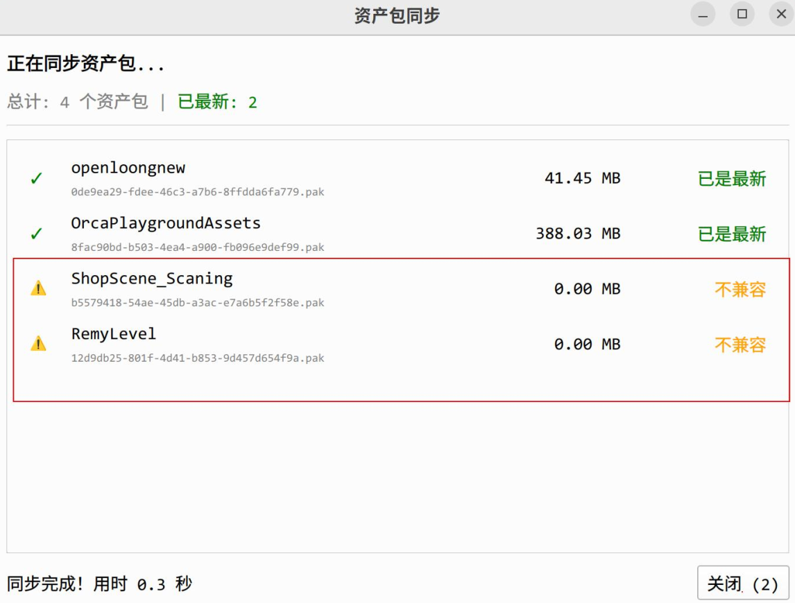

## 问题：Windows 64位操作系统安装谷歌浏览器32位版本，资产库中上传机器人模型时报加载失败 

  <strong>解决方法：</strong>

 

- 1.卸载谷歌浏览器32位版本
- 2.安装谷歌浏览器64位版本
- 3.重新上传机器人模型文件
  

## 问题：下载资产时提示不兼容 

  <strong>解决方法：</strong>

 

- 1.取消订阅旧版资产
- 2.重新订阅新版资产