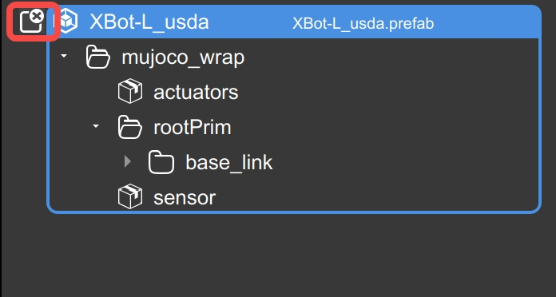

## 问题：如果导入机器人出现地面频闪 

  <strong>解决方法：</strong>

 

- 1.双击机器人prefab进入编辑模式
- 2.展开后删除worldBody

- 3.ctrl+s保存后，点击x退出编辑模式

## 问题：Windows 64位操作系统安装谷歌浏览器32位版本，资产库中上传机器人模型时报加载失败 

  <strong>解决方法：</strong>

 

- 1.卸载谷歌浏览器32位版本
- 2.安装谷歌浏览器64位版本
- 3.重新上传机器人模型文件