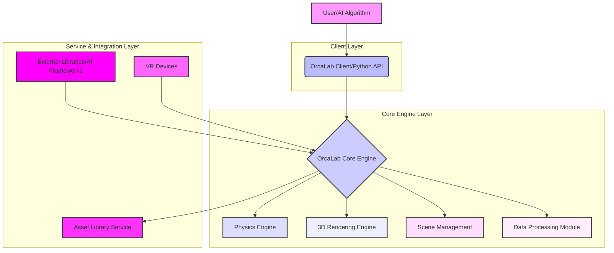

# What is the technical architecture of OrcaLab?

## Question
As a high-fidelity physics AI simulation system, how is OrcaLab's underlying technical architecture designed and implemented?

## Answer

OrcaLab's technical architecture is designed to provide a **high-performance, modular, extensible, and easy-to-use** robot AI simulation platform. It integrates multiple core components including a physics engine, 3D rendering, Python interfaces, and cloud services.

## 📋 Core Architecture Overview

OrcaLab's overall architecture can be divided into several key layers:

## 🚀 Key Technical Components

### 1. **Physics Engine**
- **Function**: Provides high-fidelity physics simulation including rigid body dynamics, collision detection & response, friction, gravity, joint constraints, etc.
- **Features**:
  - Precisely computes object motion trajectories and states after forces are applied.
  - Supports multi-threaded computation for improved physics simulation efficiency in complex scenes.
  - Configurable physics parameters (time step, iterations, contact parameters, etc.) to balance accuracy and performance.
- **Core Advantage**: Ensures the realism and reliability of simulation results, providing real-world physical feedback for robot training.

### 2. **3D Rendering Engine**
- **Function**: Renders 3D scenes, models, materials, and lighting into visual images for the user.
- **Features**:
  - Supports PBR (Physically Based Rendering) for realistic visual effects.
  - Optimized rendering pipeline leveraging GPU acceleration for real-time high-framerate display.
  - Multi-pass rendering supporting the generation of depth maps, normal maps, semantic segmentation, and other data needed for AI training.
- **Core Advantage**: Provides intuitive visualization of the simulation environment, helping users understand and debug the simulation process.

### 3. **Scene Management Module**
- **Function**: Manages all 3D objects, lights, cameras, particle effects, and other elements in the simulation scene, along with their hierarchical relationships and properties.
- **Features**:
  - Tree-structure-based outline manager for easy browsing and editing of scene hierarchy.
  - Supports asset instantiation, transformation (move, rotate, scale), and property modification.
  - Scene loading, saving, and serialization.
- **Core Advantage**: Provides flexible scene building and editing capabilities, simplifying simulation environment creation.

### 4. **Python API Interface**
- **Function**: OrcaLab exposes its core functionality to external programs through a set of Python APIs (such as the `orca-gym` library), enabling seamless integration with Python scripts.
- **Features**:
  - Control over the simulation environment: load scenes, add objects, set physics parameters, execute actions, etc.
  - Access to simulation state: get robot joint states, sensor readings, object positions and poses, etc.
  - Support for event listening and callback mechanisms.
- **Core Advantage**: Greatly facilitates AI algorithm development and integration, especially for reinforcement learning and data collection.

### 5. **Data Processing Module**
- **Function**: Supports the collection, augmentation, cleaning, and storage of data generated during simulation.
- **Features**:
  - VR teleoperation data collection: records human operation data.
  - Domain Randomization: generates diverse data by randomly varying scene parameters (such as lighting, textures, object positions) to improve AI model generalization.
  - Data format conversion: converts simulation data into common AI training data formats.
- **Core Advantage**: Provides high-quality, diverse, large-scale datasets for AI model training.

### 6. **Asset Library Service**
- **Function**: Provides online 3D asset storage, search, subscription, and management services.
- **Features**:
  - Contains six major categories of rich assets including Industrial, Lifestyle, Robotics, etc.
  - AI generation tools (Text-to-3D, Image-to-3D): quickly create custom assets through AI technology.
  - Asset package management: subscribe and sync at the asset package level.
- **Core Advantage**: Reduces the cost and time for users to acquire high-quality 3D assets, accelerating scene building.

### 7. **External AI Framework Integration**
- **Function**: Through its Python API, OrcaLab supports integration with mainstream AI frameworks (such as PyTorch, TensorFlow) and reinforcement learning libraries (such as Stable-Baselines3).
- **Features**:
  - Allows users to run and train AI models within the OrcaLab simulation environment.
  - Uses OrcaLab-generated data for model training and validation.
- **Core Advantage**: Provides a complete solution for robot AI algorithm R&D and testing.

## 🌐 Deployment & Runtime Environment

### 1. **Client Application**
- The OrcaLab client is a standalone desktop application providing a graphical user interface.
- Primarily runs on Ubuntu Linux systems.

### 2. **Python Environment**
- Manages the Python environment using Miniconda to ensure dependency isolation.
- Uses Python 3.12.

### 3. **GPU Acceleration**
- Deeply optimized to leverage the GPU parallel computing power of NVIDIA RTX series graphics cards, accelerating physics simulation and rendering.

### 4. **Modular Design**
- Components communicate through well-defined interfaces for easy extension and maintenance.
- Allows users to replace or customize specific modules.

## 📝 Summary

OrcaLab's technical architecture is a **multi-layer, multi-component collaborative system** designed to provide users with an **easy-to-use, efficient, high-fidelity robot AI simulation experience**. Its core strengths lie in its powerful physics and rendering engines, flexible Python programming interfaces, and intelligent asset management services, together forming a complete robot AI training and validation platform.

## Related Links
- [OrcaLab Product Introduction](orca-lab-introduction/orca-lab-product-introduction-v1.0.md)
- [OrcaLab Installation Guide](environment-setup/ubuntu-installation-guide-v1.0.md)