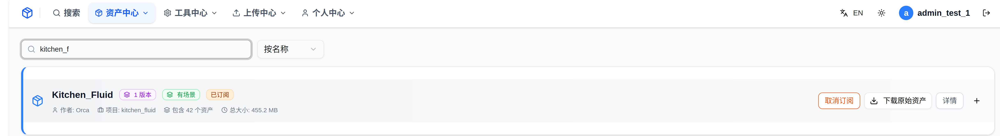
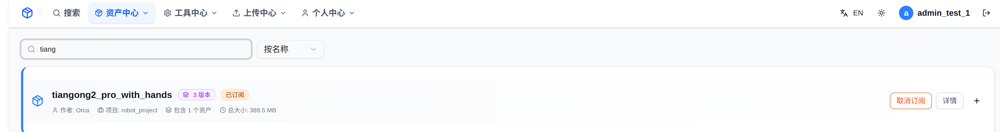
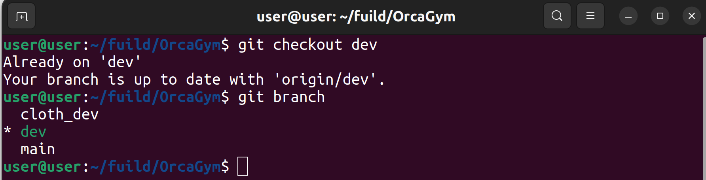
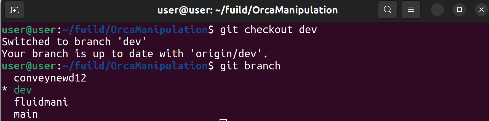
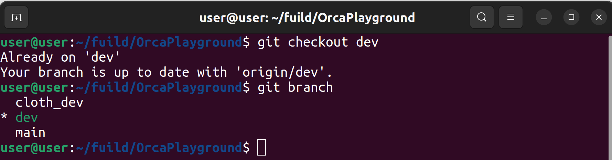
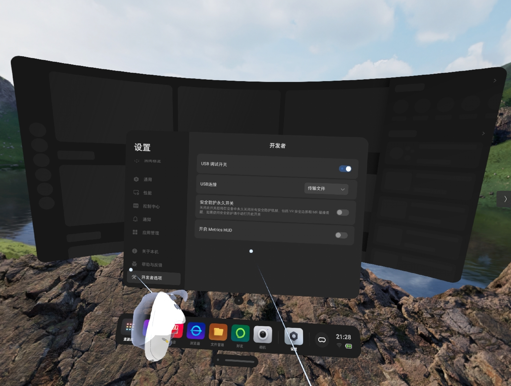
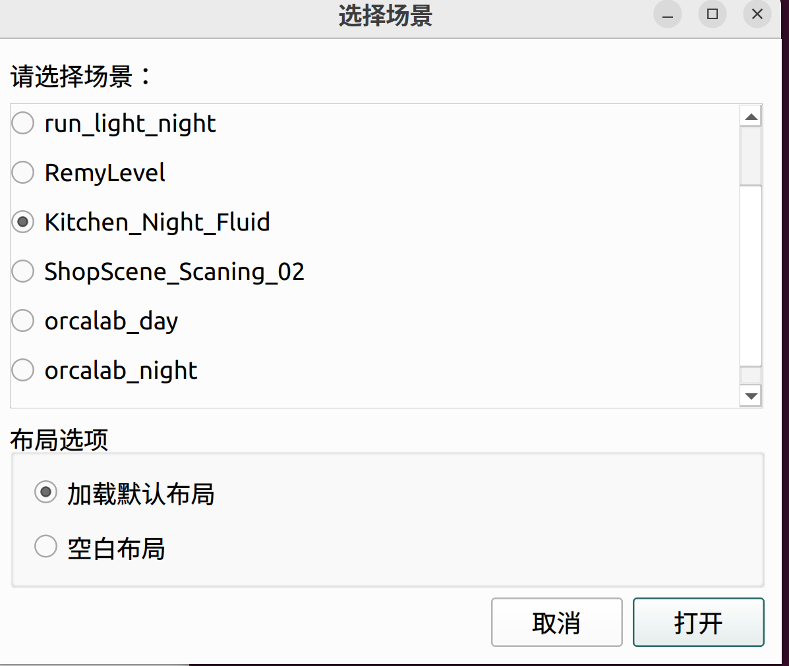
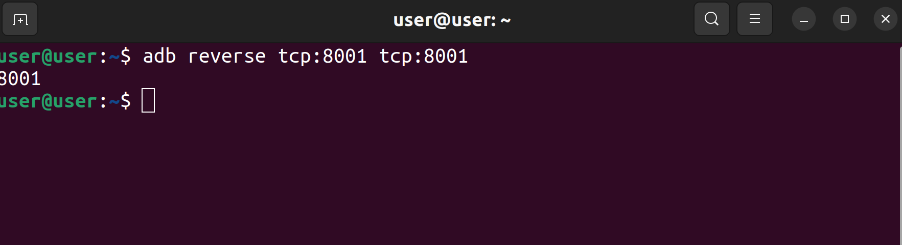
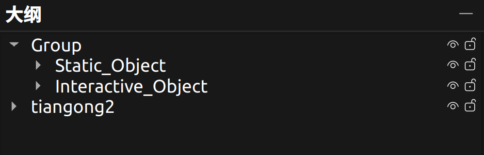
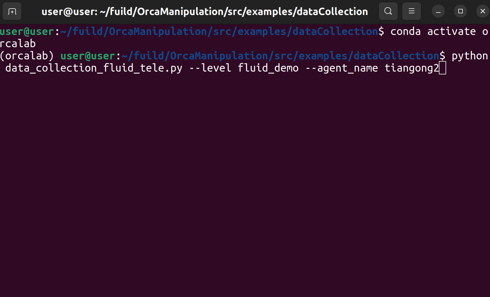

# Fluid Operation Manual

## 1. Preparation

### 1.1 Asset Library Configuration
- Asset library link: [https://simassets.orca3d.cn/](https://simassets.orca3d.cn/)
- Asset Center → Subscribe to the following assets:
  - `Kitchen_Fluid`
  - `tiangong2_pro_with_hands`




### 1.2 Create Conda Environment

```bash
conda create -n orcalab python=3.12
```

### 1.3 Download Teleoperation Code

Clone the `dev` branch of the following three repositories in the same directory:

| Repository URL | Branch |
|---------|------|
| `https://github.com/openverse-orca/OrcaGym.git` | dev |
| `https://github.com/openverse-orca/OrcaManipulation.git` | dev |
| `https://github.com/openverse-orca/OrcaPlayground.git` | dev |

**Clone command example:**
```bash
git clone -b dev https://github.com/openverse-orca/OrcaGym.git
git clone -b dev https://github.com/openverse-orca/OrcaManipulation.git
git clone -b dev https://github.com/openverse-orca/OrcaPlayground.git
```





### 1.4 Install Dependencies

Run the following in `<repo-root>/OrcaManipulation`:

```bash
pip install -r requirements.txt
```
---

## 2. Pico Setup

### 2.1 Download the Installation Package

Download the `PicoController.apk` installer to your computer.

Package path (replace `<repo-root>` with your local clone path):
```
<repo-root>/OrcaManipulation/src/examples/超市场景青龙机器人数采案例/pico安装包
```


### 2.2 Connect the Pico Device

1. Turn on the Pico and connect it to the computer with a USB cable
2. Copy the apk installer to the Pico directory


### 2.3 Install the APK Package

View the installer directory in the VR view, use the right-hand controller to press the **A button**, and confirm the installation of the apk package.

### 2.4 Enable Developer Mode

1. In the VR view, go to: **Settings → About → Software Version Number**
2. Use the confirm key **A button** to press continuously **6-7 times** to bring up Developer Mode



> **Pico setup is now complete**

---

## 3. Usage in OrcaLab

### 3.1 Launch OrcaLab

1. In a terminal, activate the conda environment used by OrcaLab:
   ```bash
   conda activate orcalab
   ```

2. Launch OrcaLab:
   ```bash
   orcalab
   ```


3. Enter the `Kitchen_Night_Fluid` scene



---

## 4. Data Collection

### 4.1 Install ADB Tools

Run in an Ubuntu terminal:

```bash
sudo apt install android-tools-adb android-tools-fastboot
```

### 4.2 Configure Pico ↔ PC Communication

1. Connect the Pico device to the PC with a USB data cable
2. Run the adb command in a terminal:

```bash
adb reverse tcp:8001 tcp:8001
```



### 4.3 Launch the VR Control Program

1. Make sure `OrcaGymCtrl` is opened in VR
2. Turn on the VR, select **Library** at the bottom
3. Find and launch `OrcaGymCtrl` in the library (this project uses the Ultra4 version)


> **Note**: After VR startup, you will be prompted to set a safety boundary. You can reset it or keep the existing boundary.

After launching `OrcaGymCtrl`, a 3D interface will appear:
- A red / blue / green 3D coordinate axis on the left
- A series of red text in the middle

This interface is normal. VR teleoperation must remain in this interface at all times.


### 4.4 Start the Simulation

1. In the outline panel on the left, move the robot asset outside the `Group` and rename it `tiangong2`



2. Click the **green start button** in the upper-right corner
3. Select **No simulation program (manual start)**


### 4.5 Launch the Data Collection Script

1. Activate the conda environment of the Python data collection project:
   ```bash
   conda activate <your-data-collection-env-name>
   ```

2. Enter the data collection script directory and launch:
   ```bash
   cd <repo-root>/OrcaManipulation/src/examples/dataCollection
   python data_collection_fluid_tele.py --level fluid_demo --agent_name tiangong2
   ```

> **Note**: The simulation must be ready; SceneManager connects to `localhost:50051` by default. If OrcaLab uses a different port, make sure it is consistent with the code or port mapping.



### 4.6 Controller Operation Guide (Start Collection)

#### Robot Arm Reset / Enter Grasp Mode
Press the **left stick, then right stick** in sequence. The robot arm in the simulation becomes movable and the robot enters grasp operation mode.

#### Start / End a Trajectory Recording
Left controller grip key (`L_GRIPBUTTON`): toggles between "Not Started → Collecting → Ended" states; used to start and end the HDF5 recording for this episode (data is kept on task success, discarded on failure).

#### Grippers & Dual-Arm Control
| Controller | Button | Function |
|------|------|------|
| Left controller | X, Y, left trigger | Control left gripper |
| Right controller | A, B, right trigger | Control right gripper |
| Left controller | Left Transform | Control left arm OSC pose |
| Right controller | Right Transform | Control right arm OSC pose |

> **Important**: Make sure to master the grip key to correctly start and stop recording.
