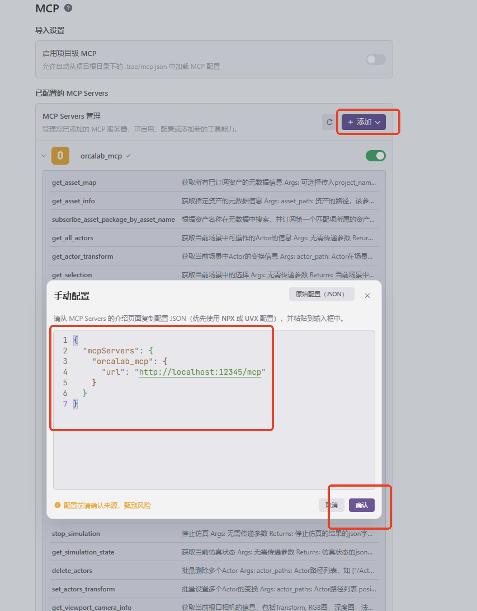
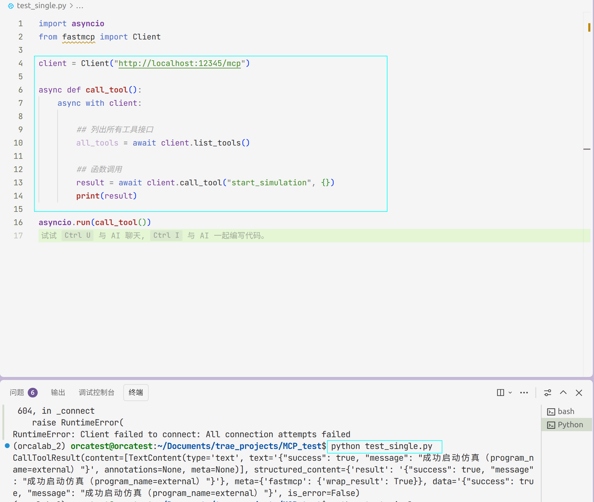
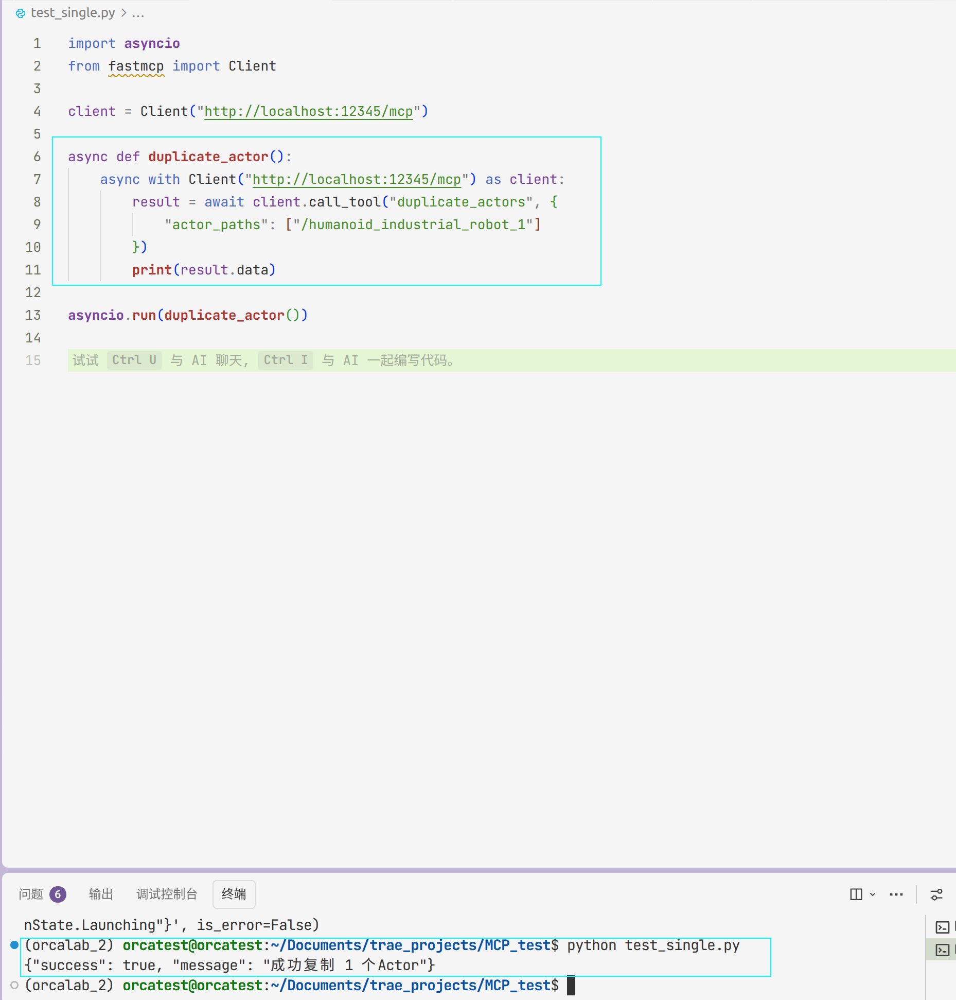
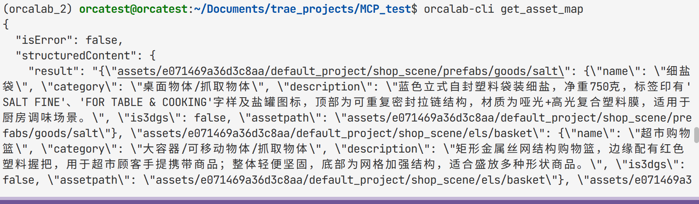
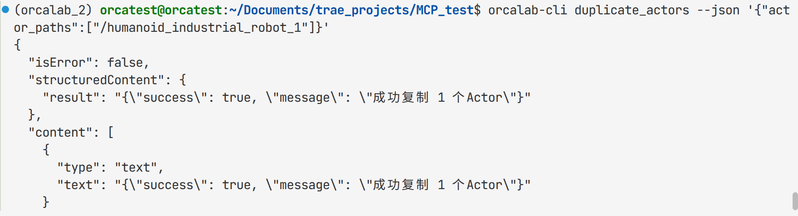

# 🐋 OrcaLab MCP & CLI User Guide

## 📋 Overview

OrcaLab provides two methods of invocation:

- **🤖 MCP (Python SDK)**: Asynchronous invocation via the `fastmcp` library, suitable for writing automation scripts
- **💻 CLI (Command Line)**: Direct execution via `orcalab-cli`, suitable for quick debugging and manual operations

> 💡 Both offer identical functionality. CLI is a wrapper around MCP functions.

---

## 🔌 MCP User Guide

### 1. Environment Setup

#### 1. Launch OrcaLab

OrcaLab must be running first for the MCP service to connect.

> 🖥️ Run the OrcaLab application in your desktop environment

#### 2. Connect to MCP

**Cursor & Trae Configuration:**



```json
{
  "mcpServers": {
    "orcalab_mcp": {
      "url": "http://localhost:12345/mcp"
    }
  }
}
```

**Claude Code Configuration:**

```bash
claude mcp add --transport http orcalab_mcp http://localhost:12345/mcp
```

### 2. Using MCP

> ⚠️ **Note**: The MCP & CLI service requires OrcaLab to be running.

**Method 1: Access via General-Purpose Agent**
1. 🔗 Connect MCP to Cursor, Trae, or Claude Code to control OrcaLab through conversation
2. ⌨️ `orcalab-cli` can be operated directly from the command line

**Method 2: Quick Access via Code Interface**

**1. Calling without parameters example**



```python
import asyncio
from fastmcp import Client

client = Client("http://localhost:12345/mcp")

async def call_tool():
    async with client:
        # 📋 List all tool interfaces
        all_tools = await client.list_tools()

        # 🚀 Function call
        result = await client.call_tool("start_simulation", {})
        print(result)

asyncio.run(call_tool())
```

**2. Calling with parameters example**



```python
import asyncio
from fastmcp import Client

async def duplicate_actor():
    async with Client("http://localhost:12345/mcp") as client:
        result = await client.call_tool("duplicate_actors", {
            "actor_paths": ["/humanoid_industrial_robot_1"]
        })
        print(result.data)

asyncio.run(duplicate_actor())
```

**▶️ Run:**

```bash
python test_single.py
```

**📤 Output:**

```json
{"success": true, "message": "Successfully duplicated 1 Actor"}
```

---

## 💻 CLI User Guide
### 1. Environment Setup
```bash
# 🌐 CLI is typically installed alongside OrcaLab, use within the conda environment
conda activate orcalab

# ✅ Test connection
orcalab-cli -h
orcalab-cli get_all_actors
```

### 2. Usage Examples

> `function` can be replaced with any function from the available function list below. Functions with parameters use JSON wrapping.

**1. Function without parameters example**



```bash
orcalab-cli function   # Function without parameters
```

**2. Function with parameters example**



```bash
orcalab-cli function --json '{"actor_path":"/Actor",...}'  # Function with parameters; parameters must be placed in JSON
```

> 💡 Note: There are other parameters available, but the defaults are generally sufficient.

**Additional examples:**

```bash
# 📦 Get asset map
orcalab-cli get_asset_map

# 📸 Get viewport screenshot
orcalab-cli get_viewport_png --json '{"index":0}'

# 📋 Duplicate Actor
orcalab-cli duplicate_actors --json '{"actor_paths":["/humanoid_industrial_robot_1"]}'
```

---

## 📚 Common Function Quick Reference

| Function | Function Name | Description |
|------|--------|------|
| 📋 Get All Actors | `get_all_actors` | List all Actors in the scene |
| 📍 Get Actor Transform | `get_actor_transform` | Get the position/rotation/scale of a specified Actor |
| ✏️ Set Actor Transform | `set_actor_transform` | Modify the transform properties of a specified Actor |
| ➕ Add Actor | `add_actor` | Add a new Actor to the scene |
| ❌ Delete Actor | `delete_actor` | Delete a specified Actor |
| 📋 Duplicate Actors | `duplicate_actors` | Duplicate one or more Actors |
| 👆 Get Selection | `get_selection` | Get the currently selected Actor |
| 🎯 Set Selection | `set_selection_and_active_actor` | Set the currently selected Actor |
| 🧹 Clear Selection | `clear_selection` | Clear the current selection |
| 📦 Get Asset List | `get_asset_map` | Get the project asset directory |
| ℹ️ Get Asset Info | `get_asset_info` | Get detailed information about a specified asset |
| ▶️ Start Simulation | `start_simulation` | Start physics simulation |
| ⏹️ Stop Simulation | `stop_simulation` | Stop physics simulation |
| 📊 Get Simulation State | `get_simulation_state` | Query current simulation running state |
| 🗑️ Batch Delete | `delete_actors` | Delete multiple Actors simultaneously |
| 📝 Batch Set Transforms | `set_actors_transform` | Modify multiple Actor transforms simultaneously |
| 🎥 Get Viewport Info | `get_viewport_camera_info` | Get camera parameters |
| 📸 Get Screenshot | `get_viewport_png` | Capture viewport image |
| ⚙️ Get Engine Info | `get_engine_info` | Query engine version and other information |
| 💾 Save Layout | `save_layout` | Save current scene layout |
| 📂 Load Layout | `load_layout` | Load a saved scene layout |

---

## ❓ FAQ

### 1. Actor path does not exist

```
Failed to duplicate Actor: Actor does not exist.
```

> 🔧 **Solution**: Use `get_all_actors` first to verify the path.

### 2. Incorrect function name

```
Unknown tool: 'set_selection'
```

> 🔧 **Solution**: Use the correct function name `set_selection_and_active_actor`.

### 3. Layout loading failed

```
Layout file does not exist: /home/orcatest/OrcaSim/my_layout
```

> 🔧 **Solution**: Use an absolute path to load the layout.

