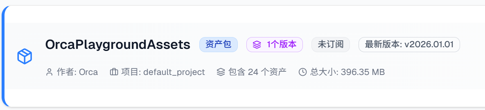

# Quick Start Simulation Guide
This guide uses a four-wheel chassis car simulation example to faithfully reproduce the physical motion characteristics of a real four-wheel chassis, intuitively simulating the effects of gravity, friction, and drive force on vehicle driving behavior. Through interactive operation and parameter adjustment, you'll gain deep understanding of how these three core physics elements are precisely represented in a simulation system — covering vehicle startup, acceleration, steering, and braking.

## ORCALab & Playground Version Compatibility

| ORCALab Version | Playground Version |
|----------------|-------------------|
| ORCALab26.4.3  | release/26.4.3    |
| ORCALab26.5.1  | release/26.5.1    |
| ORCALab26.6.3  | release/26.6.1    |
| ORCALab26.7.3  | release/26.7.1    |


## 🎯 1. Quick Start: Running a Simulation Example

#### Step 1: Clone the OrcaPlayground repository from GitHub, which already has OrcaLab support integrated.

```bash
# Clone the OrcaPlayground repository and switch directly to the target branch
git clone --branch release/xx.x.x https://github.com/openverse-orca/OrcaPlayground.git

# Enter the project directory
cd OrcaPlayground

# Activate the OrcaLab conda environment (adjust to your environment name)
conda activate orcalab  # Activate the OrcaLab environment name you created

# Install project dependencies (Tsinghua or Aliyun mirror recommended for faster download)
pip install -r requirements.txt -i https://pypi.tuna.tsinghua.edu.cn/simple
```
#### Step 2: Log in to the Asset Library and subscribe to OrcaPlaygroundAssets

```bash
Asset Library URL: https://simassets.orca3d.cn/
Subscribe to asset package name: OrcaPlaygroundAssets
```
- Subscribe to assets: Find and subscribe to the OrcaPlaygroundAssets asset


#### Step 3: Activate the OrcaLab conda environment

```bash
# Activate the OrcaLab conda environment (adjust to your environment name)
conda activate orcalab  # Activate the OrcaLab environment name you created
```
⚠️ **Note**: For OrcaLab installed via EXE on Windows, you must open a CMD prompt, navigate to the OrcaPlayground directory, and launch OrcaLab from the command line.

#### Step 4: Launch OrcaLab from the current directory

```bash
# Launch OrcaLab from the project root directory OrcaPlayground (this is when .orcalab/config.toml is automatically loaded)
orcalab
```

⚠️ **Note**: If OrcaLab was already open, after subscribing to assets you need to close the OrcaLab client. The subscribed asset download will be triggered automatically on the next launch.

#### Step 5: Run the Example in OrcaLab

1. Find the Hummer yellow car in the asset list and drag it into the layout above.
2. Click the Run button in the upper-right corner of the OrcaLab interface to open the simulation program selection window.
3. Select the corresponding example program from the **Simulation Program** list:

   - `run_ackerman` - Car simulation

   

4. After starting the simulation program, use the W, S, A, D keys to control movement direction (forward, backward, left, right).


**For more configuration details, see: OrcaPlayground/examples/wheeled_chassis/README.md**

---
 ## 2. OrcaPlayground Project Repository Overview & Other Example Descriptions

 ## 📦 Project Structure

```
OrcaPlayground/
├── envs/                  # Environment definition modules (reference implementations; see envs/README.md for details)
│   ├── legged_gym/        #   Legged robots (SB3 / RLlib training + interactive simulation)
│   ├── franka_rl/         #   Franka multi-arm robots (SB3 + HER training)
│   ├── manipulation/      #   Single/dual-arm manipulation environments
│   ├── drone/             #   Drone thrust environments
│   ├── fluid/             #   SPH fluid coupling simulation
│   ├── character/         #   Humanoid character animation
│   ├── wheeled_chassis/   #   Differential / Ackermann chassis
│   ├── g1/  zq_sa01/  xbot_gym/  # Humanoid / quadruped robot environments
│   └── common/            #   Common utilities such as scene model scanning
├── examples/              # Example code directory
│   ├── character/         # Character simulation (includes README.md)
│   ├── legged_gym/        # Legged robot RL training + interactive simulation (includes README.md)
│   ├── wheeled_chassis/   # Wheeled chassis: differential + Ackermann (includes README.md)
│   ├── xbot/              # XBot bipedal robot (includes README.md)
│   ├── d12/               # D12 dual-arm robot (demo script trajectories + ACT policy, includes README.md)
│   ├── franka_rl/         # Franka multi-arm RL (SB3 + HER, includes README.md)
│   ├── ant_rl/            # Ant robot RL (Ray RLlib APPO multi-environment parallel, includes README.md)
│   ├── drone_driver/      # Drone thrust-driven simulation (includes README.md)
│   ├── zq_sa01/           # ZQ SA01 humanoid (includes README.md)
│   ├── g1/                # G1 humanoid (includes README.md)
│   ├── orca_locomotion/   # OrcaLocomotion: Go2 / G1 policy playback (includes README.md)
│   ├── replicator/        # Scene replication: Actor / Light (includes README.md)
│   └── fluid/             # Fluid simulation (includes README.md)
├── .orcalab/              # OrcaLab configuration files
│   └── config.toml        # External program configuration
└── requirements.txt       # Python base dependencies
```

## 📚 Example Descriptions

For detailed usage instructions for all examples, please see the `README.md` files in each example directory under examples/:

- **Character Simulation** - (examples/character/README.md): Remy character keyboard/waypoint control
- **Legged Robot RL Training** -(examples/legged_gym/README.md): SB3 PPO + RLlib APPO, supports Lite3 / Go2 / G1, etc.
- **Wheeled Chassis** - (examples/wheeled_chassis/README.md): Differential drive + Ackermann steering
- **XBot Robot** - (examples/xbot/README.md): Bipedal walking based on humanoid-gym pre-trained model
- **D12 Dual-Arm Robot** - (examples/d12/README.md): Scripted trajectory playback ([demo](examples/d12/demo/README.md)) + ACT policy inference ([act](examples/d12/act/README.md))
- **Franka Multi-Arm RL** - (examples/franka_rl/README.md): SB3 + HER, multi-arm parallel training + local coordinate isolation
- **Ant RL** - (examples/ant_rl/README.md): Ray RLlib APPO multi-environment parallel training (single machine / cluster)
- **Drone Thrust-Driven Simulation** - (examples/drone_driver/README.md): CTBR controller + multi-vehicle profiles, keyboard / gamepad control
- **ZQ SA01 Humanoid** - (examples/zq_sa01/README.md): Isaac Gym PPO model porting
- **G1 Humanoid** - (examples/g1/README.md): ASAP policy porting, free walking + keyboard control + Mimic motions
- **OrcaLocomotion** - (examples/orca_locomotion/README.md): PyPI package playback of Go2 / G1 locomotion control policies
- **Scene Replication** - (examples/replicator/README.md): Batch generation of Actors and Lights
- **Fluid Simulation** - (examples/fluid/README.md): SPH fluid coupled with MuJoCo rigid bodies


> **⚠️ Important Note: Asset Preparation**
>
> Each example requires corresponding 3D assets to run properly. **Please be sure to check the README.md file in each example directory** to understand:
> - 📦 Required subscribed assets
> - 🔧 Whether assets need to be manually dragged into the scene layout
> - 📝 Corresponding model names
>
> Asset subscription URL: https://simassets.orca3d.cn/

## 📋 Dependency Notes


Main dependencies:
- `orca-gym>=25.12.4` - OrcaGym core package (includes numpy, gymnasium, mujoco, grpcio, etc.)
- `torch>=2.0.0` - PyTorch (for model inference)
- `stable-baselines3>=2.3.2` - SB3 RL training (optional)
- `onnxruntime>=1.16.0` - ONNX model inference (optional)

For detailed dependency information, please see `requirements.txt` files under each examples/ directory.

## 🔧 Configuring Simulation Programs in OrcaLab

### Configuration File Location

The OrcaLab configuration file is located at `.orcalab/config.toml`. OrcaLab automatically loads this configuration file from the working directory upon launch.

### Pre-configured Simulation Programs

- `run_sim_loop` - Empty loop simulation
- `character` - Character simulation
- `legged_train` - Legged robot training (SB3 PPO)
- `legged_rllib_train` - Legged robot training (RLlib APPO)
- `wheeled_chassis` - Wheeled chassis simulation (differential drive)
- `anker_chassis` - Ackermann steering chassis simulation
- `xbot_orca` - XBot simulation
- `g1` - G1 humanoid simulation
- `zq_sa01` - ZQ SA01 humanoid simulation
- `run_actors` - Actor scene replication
- `run_lights` - Light scene replication
- `franka_reach_train` - Franka multi-arm Reach task training (TQC + HER)
- `fluid_sim` - Fluid simulation

### Adding a New Simulation Program

To add a new simulation program, edit the `.orcalab/config.toml` file and add a new entry in the `[[external_programs.programs]]` section.

#### Configuration Format

```toml
[[external_programs.programs]]
name = "your_program_name"           # ⚠️ Required: unique program identifier
display_name = "Display Name"        # ⚠️ Required: name displayed in OrcaLab UI
command = "python"                   # ⚠️ Required: execution command (typically "python")
args = ["-m", "examples.your_module.run_script"]  # ⚠️ Required: command-line argument list
description = "Program description"  # Optional: program description
```

#### Parameter Descriptions

| Parameter | Type | Required | Description |
|------|------|------|------|
| `name` | string | ✅ Yes | **Unique program identifier**, used internally by OrcaLab to find and launch the program. Must not duplicate the `name` or `display_name` of any other configured program. Use lowercase letters, numbers, and underscores (e.g., `my_program`). |
| `display_name` | string | ✅ Yes | **Display name**, shown to users in the OrcaLab launch dialog UI. Must not duplicate the `name` or `display_name` of any other configured program. May use Chinese characters, spaces, etc. (e.g., `My Program`). |
| `command` | string | ✅ Yes | **Execution command**, typically `"python"`, but can be other executable commands (e.g., `"python3"`, `"conda"`, etc.). |
| `args` | string array | ✅ Yes | **Command-line argument list**, each argument as an array element. For example:<br>- Module mode: `["-m", "examples.module.run_script"]`<br>- Script mode: `["examples/script.py", "--arg1", "value1"]`<br>- With arguments: `["-m", "examples.module.run", "--config", "config.yaml", "--train"]` |
| `description` | string | ❌ No | **Program description**, used for tooltips in the OrcaLab UI to help users understand the program's functionality. |

#### ⚠️ Important Notes

1. **`name` and `display_name` must not duplicate**
   - ❌ **Forbidden**: Two programs with the same `name`
   - ❌ **Forbidden**: Two programs with the same `display_name`
   - ❌ **Forbidden**: One program's `name` matching another program's `display_name`
   - ✅ **Allowed**: Within the same program, `name` and `display_name` may differ (typically recommended to be different for clarity)

2. **`name` uniqueness requirements**
   - `name` is the program's unique identifier in the system; OrcaLab uses `name` to find and launch programs
   - If `name` is duplicated, `get_external_program_config()` will only return the first matching program, causing subsequent programs to fail to launch correctly
   - Use meaningful, descriptive names such as `legged_train`, `character_sim`, etc.

3. **`display_name` uniqueness requirements**
   - `display_name` is shown in the OrcaLab UI; duplication would prevent users from distinguishing between different programs
   - Use clear, descriptive display names such as `Legged Robot Training`, `Character Simulation`, etc.

4. **Working directory**
   - The working directory when the program launches is OrcaLab's working directory (typically the directory containing `.orcalab/config.toml`)
   - When using relative paths in `args`, ensure the path is correct relative to the working directory

5. **Module import paths**
   - When running in module mode with the `-m` flag, ensure the module path is correct
   - For example: `["-m", "examples.legged_gym.run_legged_rl"]` means running `examples/legged_gym/run_legged_rl.py`

#### Configuration Examples

```toml
# Example 1: Simple module launch
[[external_programs.programs]]
name = "my_simple_program"
display_name = "Simple Program"
command = "python"
args = ["-m", "examples.my_module.run_script"]
description = "This is a simple example program"

# Example 2: Program with command-line arguments
[[external_programs.programs]]
name = "legged_train"
display_name = "Legged Robot Training"
command = "python"
args = [
    "-m",
    "examples.legged_gym.run_legged_rl",
    "--config", "examples/legged_gym/configs/sb3_ppo_config.yaml",
    "--train",
    "--visualize"
]
description = "Launch legged robot reinforcement learning training"

# Example 3: Using script path (non-module mode)
[[external_programs.programs]]
name = "custom_script"
display_name = "Custom Script"
command = "python"
args = ["examples/custom/script.py", "--option", "value"]
description = "Run script file directly"
```

#### Verifying Configuration

After adding a new simulation program, it is recommended to:

1. **Check for duplicates**: Confirm the new program's `name` and `display_name` do not duplicate any existing configured programs
2. **Test launch**: Try launching the new program in OrcaLab to confirm the command and arguments are correct
3. **Check logs**: If launch fails, review OrcaLab's log output to check whether the command, arguments, or module path are correct

### Initial Configuration (Optional)

If `.orcalab/config.toml` does not exist in the current directory, you can use OrcaLab to generate a basic configuration:

```bash
orcalab --init-config
```

Then manually add the external simulation program configurations for this project.

## 📖 More Information

- OrcaPlayground main repository: https://github.com/openverse-orca/OrcaPlayground
- Detailed example descriptions: see `examples/*/README.md`


## 3. Technical Support

If you encounter issues, please:

1. Refer to the "Common Troubleshooting" section of this document
2. Check terminal error messages
3. Scan the QR code to contact the technical support team (please include your school/company/personal information and invitation code when joining the group)


---