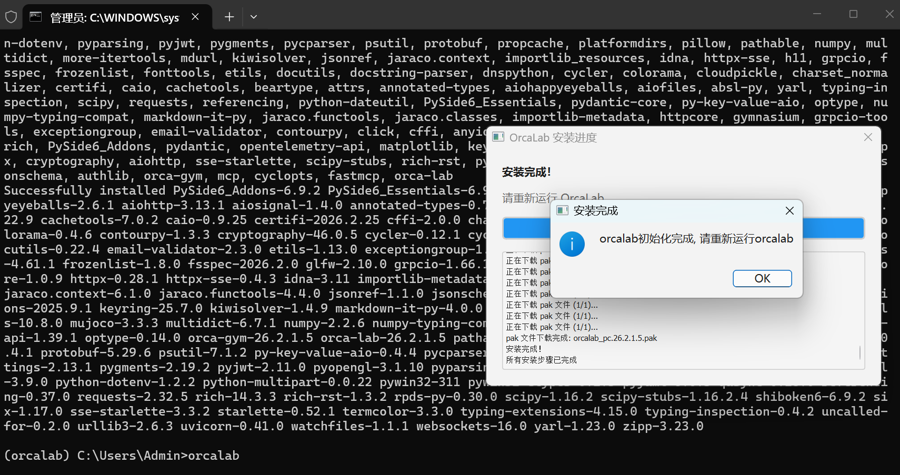
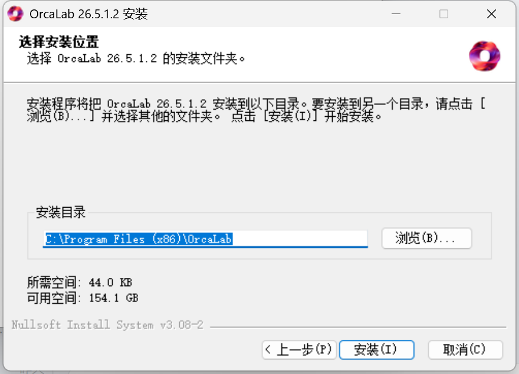
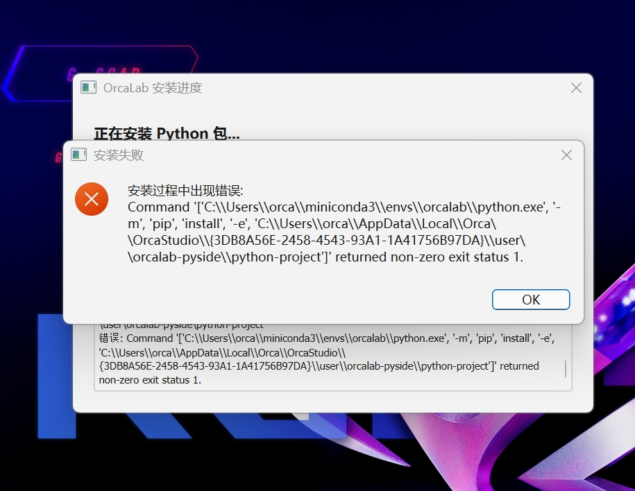
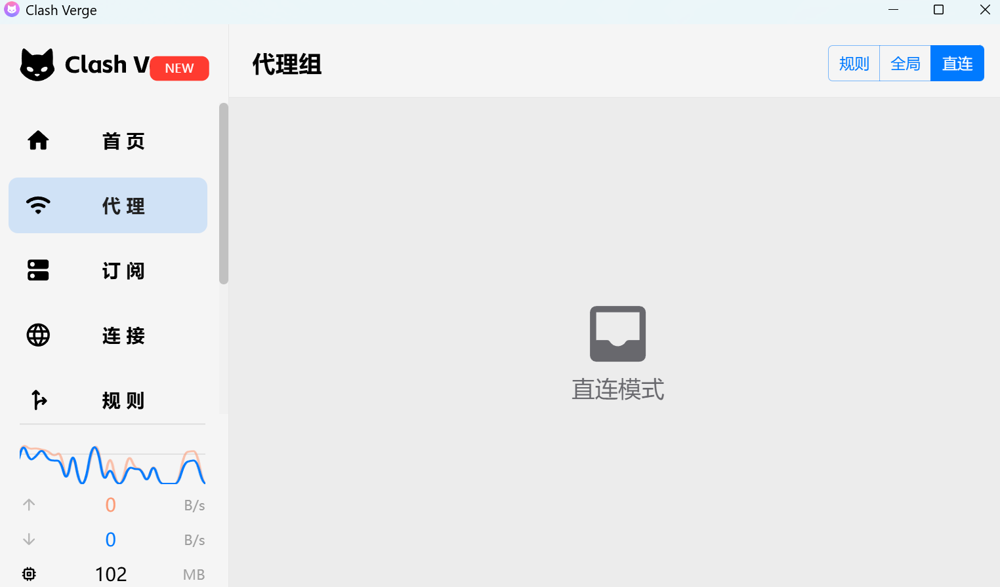
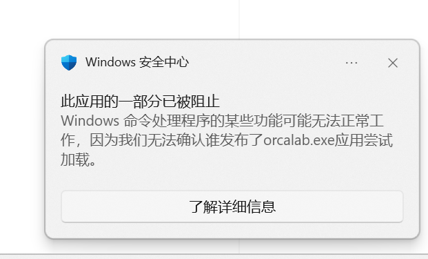
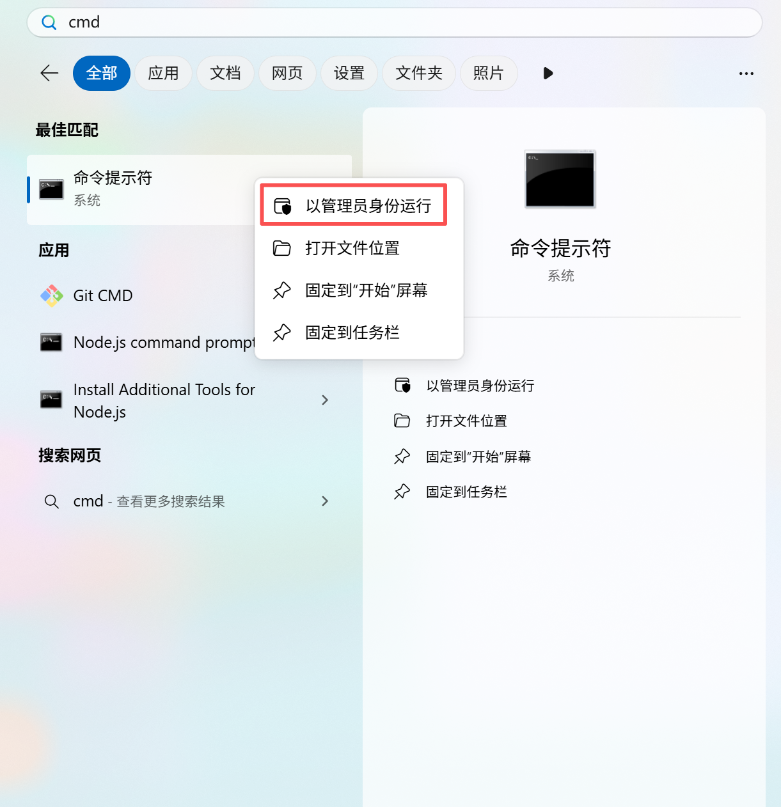

# Installing OrcaLab on Windows

## 1. System Requirements

### 1.1 Operating System and Hardware Requirements

- **Reference**: [System and GPU Support](/en/environment-setup/system-and-gpu-support.md)

### 1.2 Prerequisites

- **Miniconda**: Requires the latest version of Miniconda to be installed beforehand
- **CMD Command Prompt**: Must be launched with administrator privileges
- **Network Requirements**: A stable network connection is required
- **User Registration**: See the User Registration & Management section to complete user registration

### 1.3 ORCALab Latest Version: 26.7.1
 - The installation command in Section 2.3 downloads the latest version by default. You may also install a specific version: pip install orca-lab==xx.x.x

---

## 2. Installation Steps

OrcaLab for Windows offers two installation methods. Choose based on your needs:

- **Method 1: Conda + pip Installation**
- **Method 2: EXE Installer Package**

---

### Method 1: Conda + pip Installation

#### 2.1 Install Miniconda
**Step 1:** Download the Miniconda installer and install.
```bash
# Download the Miniconda Windows installer
https://www.anaconda.com/download/success
```
**Step 2:** Configure system environment variables
- Press Win + R, type sysdm.cpl and press Enter to open the System Properties window;
- Switch to the Advanced tab, click Environment Variables;
- Find Path in the System variables list and double-click to open;
- Click New and add the following Miniconda installation paths (replace with your actual paths)

```bash
# Miniconda installation paths
C:\ProgramData\miniconda3\
C:\ProgramData\miniconda3\Scripts\
```

**Step 3:** Verify the configuration (recommended: launch CMD as Administrator)
- Close all open command prompt windows
- Open a new command prompt window and enter the following command:
```bash
# If a version number like conda x.x.x is output, the configuration was successful
conda --version
```

### 2.2 Create a Conda Environment for OrcaLab

```bash
# Create a Python 3.12 environment named orcalab
conda create -n orcalab python==3.12

# Activate the environment
conda activate orcalab
# Upon successful activation, the conda environment name appears in parentheses, e.g.: (orcalab) C:\Users\Admin>
```

### 2.3 Install OrcaLab

```bash
# Install OrcaLab — Tsinghua or Aliyun mirror recommended. Default source installation requires a VPN and may be slow
pip install orca-lab -i https://pypi.tuna.tsinghua.edu.cn/simple
# You may also install a specific version: orca-lab==xx.x.x
```

### 2.4 Launch OrcaLab

```bash
# Run the following command in the terminal for first launch (dependencies will be installed automatically)
orcalab
```


**Note**:

- The first run of `OrcaLab` will automatically install Python dependency packages
- The second run will enter the software interface

---

### Method 2: EXE Installer Package

#### 2.1 Download the OrcaLab EXE Installer

```bash
# Download the OrcaLab Windows installer
# Please obtain the latest version of the EXE installer from official channels
Download link: https://www.orca3d.cn/download.html (Coming soon)
```

#### 2.2 Run the Installer

**Step 1:** Double-click the downloaded EXE installation file
**Step 2:** Follow the installation wizard prompts to complete installation
- Choose installation path

- Wait for installation to complete; a desktop shortcut will be created automatically

#### 2.3 Launch OrcaLab

After installation, you can launch via:
- Desktop shortcut
- Find OrcaLab in the Start Menu and launch

⚠️**Note**
- The first launch will automatically install necessary dependency packages. Wait for installation to complete. If installing dependencies indicates a network connection timeout (while local network is normal), try Method 1 and switch to the Aliyun mirror or default source.
- The second launch will enter the software interface

#### 2.4 Environment Variable Configuration

If you need to manually use conda commands in the command line, you must configure system environment variables:
- Press Win + R, type sysdm.cpl and press Enter to open the System Properties window;
- Switch to the Advanced tab, click Environment Variables;
- Find Path in the System variables list and double-click to open;
- Click New and add the following Miniconda installation paths (replace with your actual paths)

```bash
# Miniconda installation paths
C:\Users\<username>\miniconda3\
C:\Users\<username>\miniconda3\Scripts\
```

---

## 3. Verifying the Installation Environment & Version

### 3.1 Conda + pip Installation Verification

After installation, you can verify with the following:

```bash
# 1. Check Python environment
python --version  # Should display Python 3.12.x

# 2. Check OrcaLab version
pip show orca-lab

# 3. Launch the software
orcalab
```

### 3.2 EXE Installation Verification

- Check that the desktop shortcut was created properly
- Launch the software normally from the Start Menu or desktop shortcut
- Open the software and check the software version


---
## 4. Upgrading OrcaLab

### 4.1 Conda + pip Installation Upgrade
When an upgrade package is available:
```bash
# The --upgrade flag is required. You may also specify a version: orca-lab==xx.x.x
pip install --upgrade orca-lab
```

### 4.2 EXE Installation Upgrade
- Download the latest version of the EXE installer
- Run the installer; it will replace the old version by default

---

## 5. Uninstalling OrcaLab

### 5.1 Conda + pip Installation Uninstall

If you need to uninstall OrcaLab:

```bash
# 1. Exit the conda environment
conda deactivate

# 2. Remove the conda environment
conda env remove -n orcalab
```

### 5.2 EXE Installation Uninstall

- Uninstall via Windows Control Panel
- Or run the uninstaller in the installation directory


---

## 6. Common Troubleshooting

### 6.1 Installation Issues

#### 6.1.1 Issue: pip installation fails, slow download speed

**Solution**:

1. Check network connection
2. Confirm the Tsinghua PyPI mirror is configured (refer to Section 2.2)
3. Verify the mirror is accessible

```bash
# Test mirror connection
curl https://pypi.tuna.tsinghua.edu.cn/simple/
```

#### 6.1.2 Issue: conda environment activation fails

**Solution**:

```bash
# Initialize conda
conda init

# Close all command prompts, reopen a new one, then activate
conda activate orcalab
```
#### 6.1.3 Issue: Error during first-launch component package installation


**Solution**:
- Check whether a proxy is enabled. If so, disable the proxy or set it to direct connection.



#### 6.1.4 Issue: Software won't launch after installation via Method 1



**Solution**:
- In Windows Security settings, find App & Browser Control and turn off the Smart App Control switch


### 6.2 Runtime Issues

#### 6.2.1 Issue: OrcaLab crashes after syncing assets


**Solution**:
- Permission issue — check whether CMD has administrator privileges
- When opening the CMD prompt, select "Run as administrator"



#### 6.2.2 Issue: Hardware has a discrete GPU, but OrcaLab runs very sluggishly and performance monitoring shows it is actually using the integrated GPU


**Solution**:
- Preferred graphics processor setting issue — open the NVIDIA Control Panel.
- In 3D Settings, set the NVIDIA processor as the preferred graphics processor


#### 6.2.3 Issue: Software cannot connect to server after launching

**Solution**:

- Check network connection
- Verify firewall settings
- Use offline launch mode (if assets have already been downloaded)

 

### 6.2.4 Issue: Running ORCA Lab on a virtual machine shows low framerate

**Solution**:
- Since OrcaLab places significant demand on the GPU, to improve your experience, a high-performance remote desktop is recommended for remote virtual machine connections.
- After configuring Windows or Linux on your virtual machine, it is recommended to use Sunshine + Moonlight for game-grade performance remote desktop connections
- Reference download links: https://github.com/moonlight-stream/moonlight-qt/releases/tag/v6.1.0 https://github.com/LizardByte/Sunshine/releases

---

## 7. Technical Support

If you encounter issues, please:

1. Refer to the "Common Troubleshooting" section of this document
2. Check terminal error messages
3. Scan the QR code to contact the technical support team


---