# VR Teleoperation & Data Collection Guide

Songying OrcaLab uses VR teleoperation for data collection tasks, which requires following a specific workflow to configure hardware connections and launch programs. Below is the detailed operation guide, covering VR teleoperation and data collection steps, parameter descriptions, and common troubleshooting solutions.

---

## 1. Data Collection Software & Hardware Environment Setup
 - **OrcaGym OrcaManipulation** open-source repository download
 - **VR operation device** (such as Pico Ultra 4 with controllers)
 - **Scene resources** subscription

### 1.1 Clone the OrcaManipulation repository from GitHub

```bash
git clone https://github.com/openverse-orca/OrcaManipulation.git
# Enter the project directory
cd OrcaManipulation

# Activate the OrcaLab conda environment (adjust to your environment name)
conda activate orcalab  # Activate the OrcaLab environment name you created

# Install project dependencies (Tsinghua or Aliyun mirror recommended for faster download)
pip install -r requirements.txt -i https://pypi.tuna.tsinghua.edu.cn/simple
```

### 1.2 VR Teleoperation Device Preparation

VR teleoperation requires completing hardware connection and software initialization first. During data collection, the robotic arm is controlled via the controllers to execute tasks and collect data.

**Step 1**: Install the `PicoController.apk` application (APK location: OrcaManipulation/src/examples/超市场景青龙机器人数采案例/pico安装包/)
 - Use a USB cable to connect the Pico to the computer and power it on.
 - Copy `PicoController.apk` to the PICO device directory

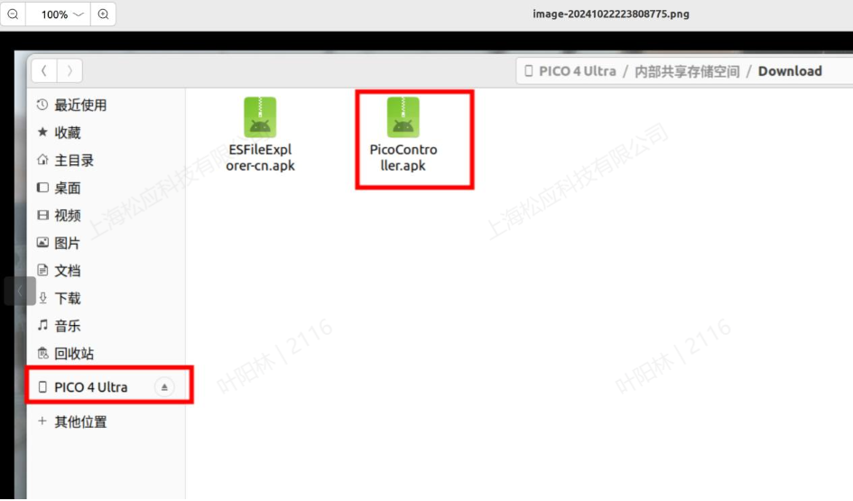
 - Wear the VR device. In the VR view, find the file manager, browse to the APK directory, and press the **A button** on the right-hand controller to confirm installation of the APK.

**Step 2**: Enable VR device developer mode
 - In the VR view, navigate to: **Settings → About → Software Version**, point at the software version number using the confirm button **A button**, and click continuously **6–7 times** to enable developer mode.
 - Turn on the debugging switch.
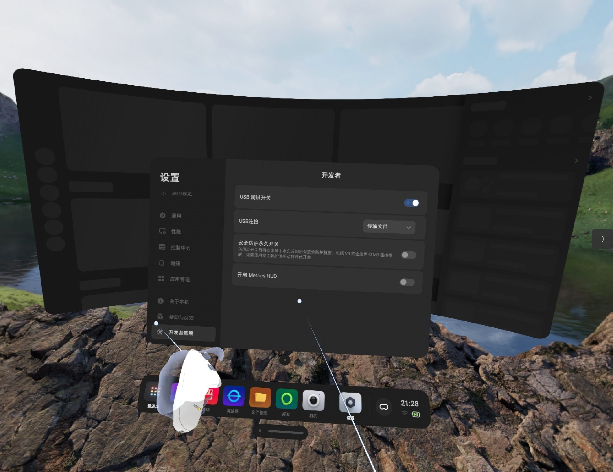
**Step 3**: Launch the VR-side OrcaGymCtrl application
 - Turn on the VR device and select "Library" at the bottom (on Pico Ultra 4 devices, search for "OrcaGymCtrl" directly in the Library).
 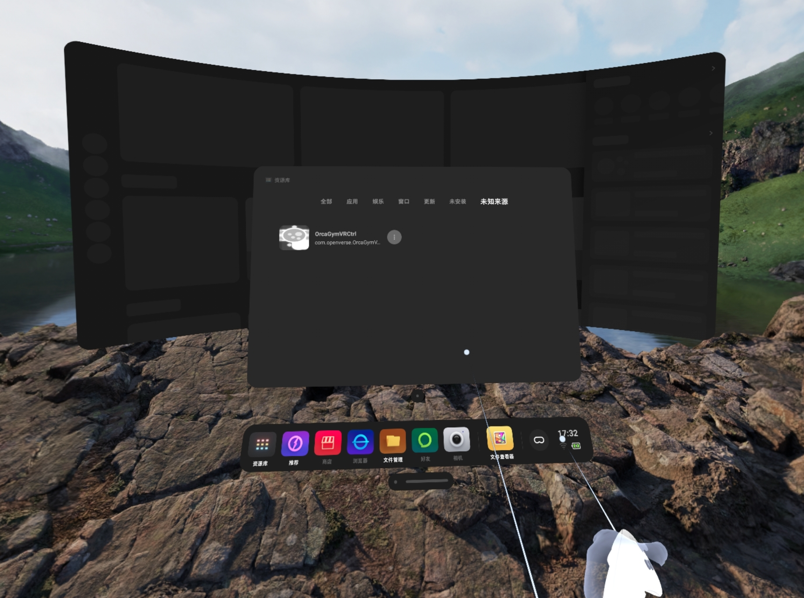
 - After VR starts, you will be prompted to set a safety boundary. You can choose "Reset Boundary" or "Keep Existing Boundary" (default configuration).
 - After launching OrcaGymCtrl, you will enter a 3D program interface: the left side displays a 3D red-blue-green coordinate axis, with red text in the center. **The VR teleoperation requires this interface to remain active at all times**.
 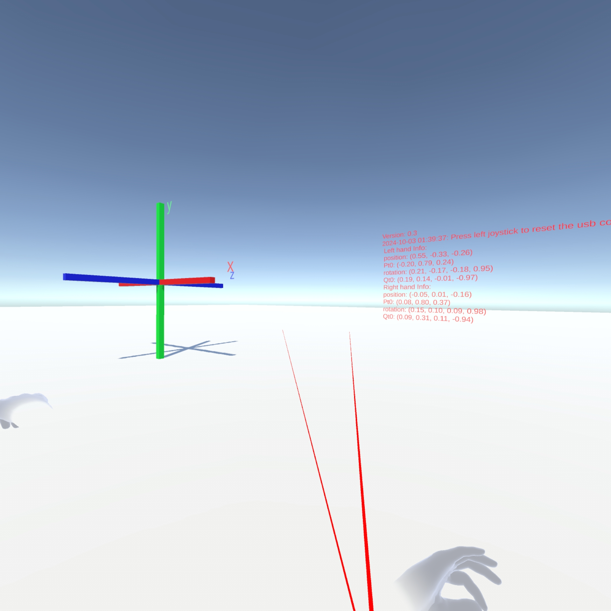

**Step 4**: Install ADB tools (Windows requires downloading ADB tools and configuring environment variables)
Run the following command in the Ubuntu terminal to install Android Debug Bridge (adb):
 ```bash
sudo apt install android-tools-adb android-tools-fastboot
```
 **Step 5**: Establish PICO-to-PC communication
- Use a USB data cable to connect the Pico device to the PC.
- Run the following command to reverse-map the port (ensuring normal communication):

```bash
 adb reverse tcp:8001 tcp:8001
```
- ⚠️**Note**: This command must be re-executed each time the PC restarts or the PICO USB connection is disconnected. Successful execution will display "start successful"; if the command has already been executed, running it again may produce no output, which is normal.

 ### 1.3 Scene Asset Package Preparation

 The following content uses the `Qinglong Robot` + `Supermarket Scene` as an example to demonstrate the robot assets and scene assets required for a data collection scene task.

 **Subscribe to Relevant Assets**

1. Asset Library URL: https://simassets.orca3d.cn/

2. Asset Center → Subscribe to lighting asset (required) **run_light_night**

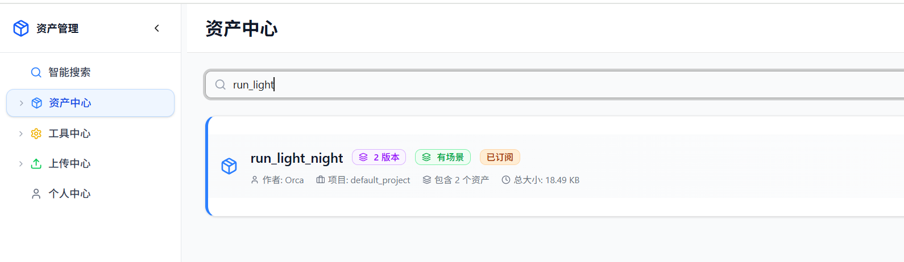

3. Asset Center → Subscribe to scene asset (select based on scene requirements) **ShopScene_Scaning**

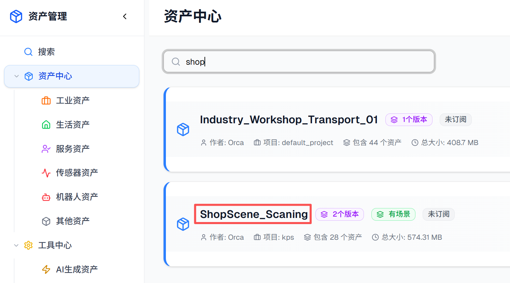

4. Asset Center → Subscribe to robot asset (select based on scene requirements) **openloong**

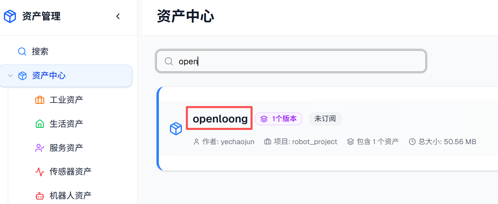


## 2. Teleoperation Data Collection

After completing the above preparations, using the `Qinglong Robot` + `Supermarket Scene` as an example, add the layout and begin the data collection task.

 - **Confirm PICO connection is working**:
   - After launching OrcaGymCtrl, you will enter a 3D program interface: the left side displays a 3D red-blue-green coordinate axis;
   - ADB port connection successful.
 - **Asset packages subscribed successfully**: Personal Center shows subscribed `ShopScene_Scaning` and `openloong` asset packages.


  ### 2.1 Open Scene & Layout in OrcaLab

1. In the terminal, enter the OrcaLab conda environment:
```bash
# Activate the orcalab conda environment
conda activate orcalab
```
2. Run the command to launch OrcaLab:
```bash
# Launch OrcaLab
orcalab
```
3. During launch, subscribed assets will be downloaded automatically. Please wait for download and sync to complete.
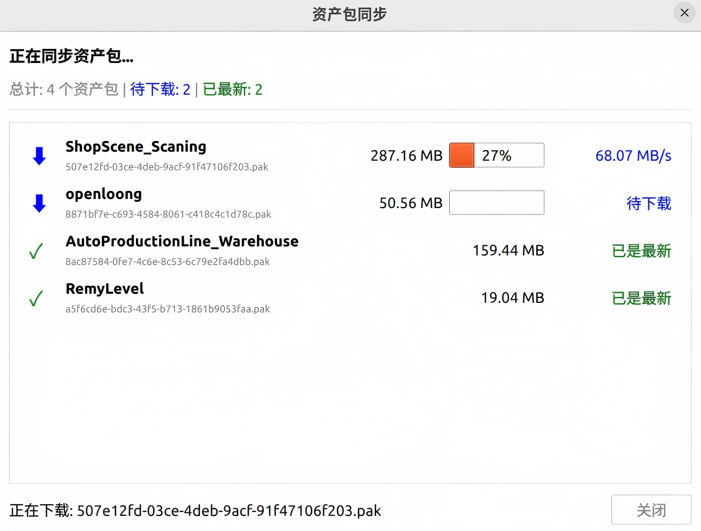

4. After asset download is complete, in the Select Scene dialog, choose the **shop scene** and select the default layout.
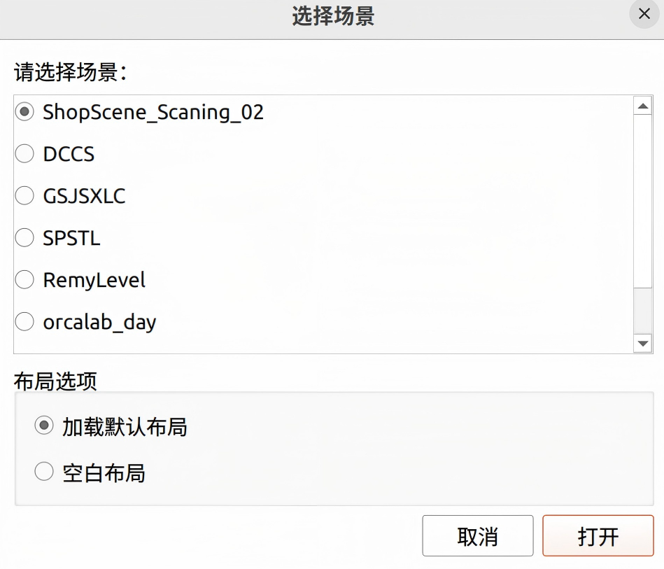

5. In the OrcaLab client menu bar, select **Open Layout** and load the `shop_openloong.json` file.
```bash
# Layout JSON file path (Note: the layout file defines the robot's initial position and pose)
  ~/OrcaManipulation/src/examples/超市场景青龙机器人数采案例/shop_openloong.json
```
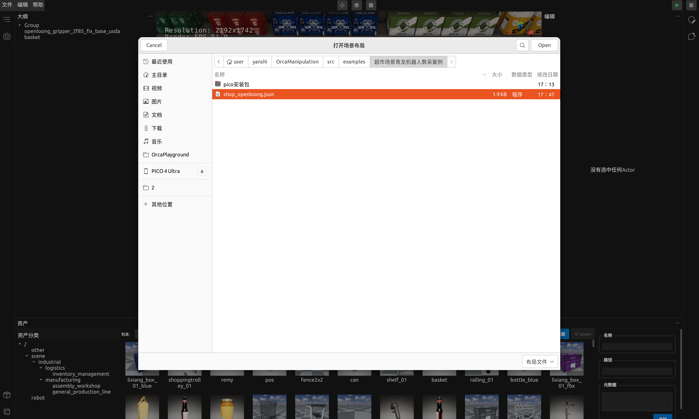

6. The YAML file for the shopScene example scene has been pre-configured as example.yaml. For detailed information on configuration parameter meanings, please refer to Chapter 3: Data Collection Task Configuration File Description.
```bash
# example.yaml file path
~/OrcaManipulation/src/examples/dataCollection
```
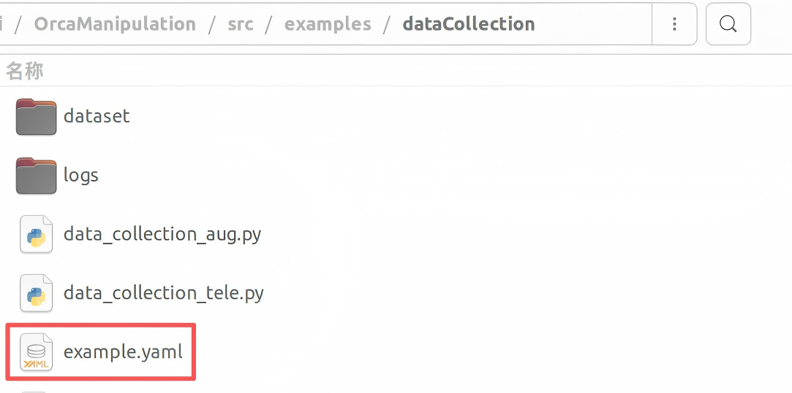

### 2.2 Start Simulation

1. Click the **green Start button** in the upper-right corner of the interface
2. Select **No Simulation Program (Manual Start)**
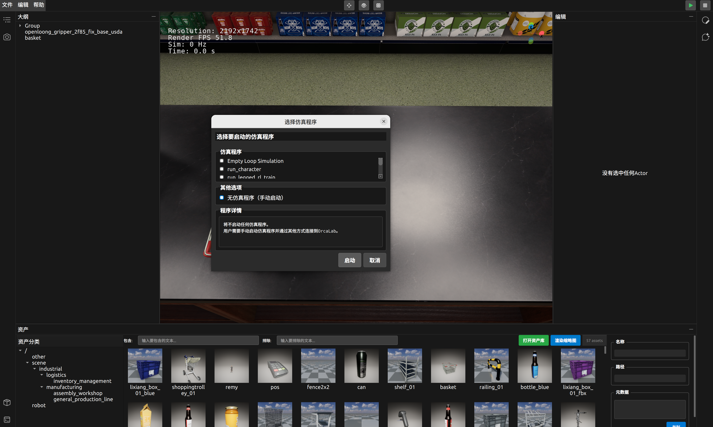

### 2.3 Run the Data Collection Script

1. Activate the conda environment required for the data collection script:
```bash
conda activate orcalab
```

2. Navigate to the data collection script directory and launch
```bash
cd ~/OrcaManipulation/src/examples/dataCollection
# Start the data collection script; ensure asset configuration in example.yaml is correct
# Parameter descriptions (fill in as applicable): level — scene name, agent_name — robot name, task_config — task file
python data_collection_tele.py  --level shop_scaning --agent_name openloong  --task_config example.yaml
```

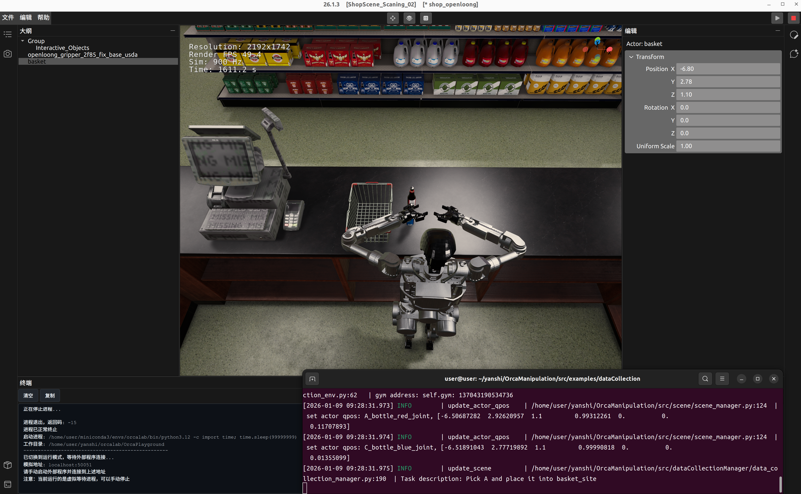

### 2.4 VR Teleoperation Data Collection

1. **Robot Arm Reset** — enter grasping mode
   - Press the **Left Joystick** and then the **Right Joystick** in sequence
   - The robot arm in the simulation environment becomes movable, and the robot enters grasping operation mode
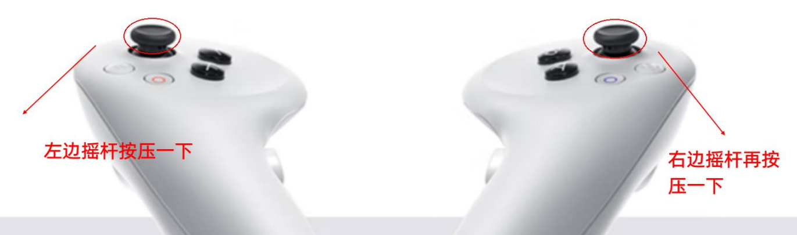

2. **Controller Button Mapping**

   - **Left Controller**
     - **Y Button long press**: Left hand grasp
     - **X Button**: Left hand release

   - **Right Controller**
     - **B Button long press**: Right hand grasp
     - **A Button long press**: Right hand release

3. **Data Collection & Storage**

   - Refer to the collection script output information below. At update_scene, press the left controller trigger once to enter data collection state.
   - According to the task prompts, grasp the target object and place it in the basket.
   - After completing the grasp, press the left controller trigger once more to save the collected data. The save directory will be displayed. If data collection fails, proceed to the next task.

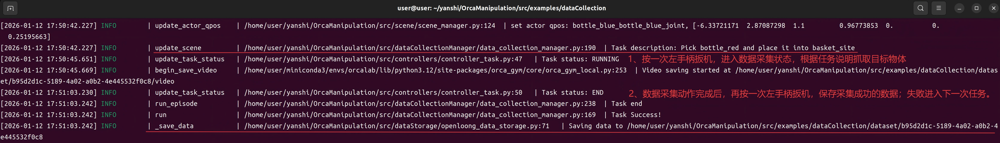


## 3. Data Collection Task Configuration File Description
A detailed explanation of each field in the task configuration example YAML file, along with guidance on configuring your own scene task configuration file from scratch.
Suitable for users using OrcaLab for task configuration for the first time who need to build their own scene and complete data collection tasks.

### 3.1 Configuration File Core Module Overview
| Module Category | Module Name | Core Function | Key Notes |
|----------|----------|----------|----------|
| Basic Info | level_name | Scene name identifier | Used for logging, dataset differentiation, and task replay. Use business-semantic names (e.g., pharmacy_pick) |
| Basic Info | type | Task type definition | Supports pick_and_place (grasp and place) and scan_qr (QR code scanning). Determines the task module configuration structure |
| Dynamic Objects | actor | Dynamic object loading configuration | Defines the name, path, joints, and randomization rules for objects randomly generated in tasks (medicines/bottles/boxes, etc.) |
| Scene Lights | light | Light parameter configuration | Controls the number, position, and randomization strategy of scene lights to enhance data diversity |
| Task Logic | task | Task goal configuration | Must be consistent with the top-level type. Defines the task target object/area and placement site |

### 3.2 Configuration Field Detailed Description
| Field Category | Specific Field | Configuration Example/Format | Key Notes |
|----------|----------|---------------|--------------|
| Basic Info | level_name | level_name: "example" | String format; must uniquely identify the scene |
| Basic Info | type | type: "pick_and_place" | Only pick_and_place / scan_qr supported |
| actor module | names | names: ["A", "B", "C", "D", "E"] | Array format; one-to-one correspondence with spawnable |
| actor module | spawnable | spawnable: ["assets/.../prefabs/kps/pipalu"] | Points to the asset library prefab path; incorrect path will prevent object generation |
| actor module | joints | joints: [...] | Defines object root joints / controllable joints for pose control |
| actor module | joints_dof | joints_dof: [6, 6, 6, 6, 6] | 1 = single DOF / 3 = spherical joint / 6 = rigid body joint; count must match joints |
| actor module | random.qpos | qpos: true | true = joint position randomization / false = fixed |
| actor module | random.nums | nums: [1, 5] | Array format; defines actor generation count range (1–5) |
| actor module | random.six_dof.center | center: [2.47, -2.33, 1.24] | Random center point in world coordinate system |
| actor module | random.six_dof.bound_position | bound_position: [[-0.1, 0.1], [-0.1, 0.1], [0, 0]] | XYZ direction offset range; min = max means that dimension is fixed |
| actor module | random.six_dof.bound_rotation | bound_rotation: [[0, 0], [0, 0], [0, 1]] | Rotation range around XYZ axes (radians) |
| light module | names | names: ["spotlight1"] | Light instance name; array format |
| light module | spawnable | spawnable: ["prefabs/spotlight"] | Light prefab path |
| light module | random.position/rotation | position: false<br>rotation: false | Whether to enable position/rotation randomization |
| light module | random.center/bound_position/bound_rotation | center: [0, 0, 0]<br>bound_position: [[-1, 1], [-1, 1], [0, 2]]<br>bound_rotation: [[0, 3.14159], [0, 3.14159], [0, 3.14159]] | Same rules as actor module six_dof |
| light module | random.nums | nums: [1, 1] | Number of lights generated each time |
| light module | random.cycle | cycle: 20 | Update light configuration every 20 tasks |
| task module | type | type: "pick_and_place" | Must match top-level type |
| task module | goal.name | name: "MedicineChest" | Target object/area name |
| task module | goal.site | site: "MedicineChest_site" | Placement site defined in the scene; if it does not exist, the task fails |

### 3.3 New Scene Configuration Steps
| Step Category | Specific Step | Operation Description | Key Notes |
|----------|----------|----------|--------------|
| Preparation | Clarify task type | Choose pick_and_place / scan_qr | Determines the subsequent configuration field structure |
| Preparation | Verify asset paths | Confirm all spawnable paths are valid | Incorrect paths will prevent object/light generation |
| Core Configuration | Configure actor parameters | Fill in names, spawnable, joints, joints_dof | joints_dof count must match joints |
| Core Configuration | Set actor randomization rules | Configure qpos, nums, six_dof under random | Overly large random ranges may cause objects to clip through or fall |
| Core Configuration | Configure light parameters | Fill in names, spawnable, and randomization rules | The cycle parameter can improve data diversity |
| Core Configuration | Configure task goals | Fill in type, goal.name, goal.site | Confirm the site actually exists in the scene |
| Verification | Small-scale verification | Set nums to [1,1] to test the configuration | Verify first, then expand the random range |

### 3.4 Common Configuration Errors & Troubleshooting
| Error Type | Error Description | Troubleshooting Suggestions |
|----------|----------|----------|
| Asset Loading | spawnable path incorrect | Verify the asset library prefab path; ensure no typos in the path |
| Load Failure | joints and joints_dof counts are inconsistent | Check the array lengths of both fields; keep one-to-one correspondence |
| Object Anomaly | Random range too large | Reduce the bound_position / bound_rotation range in six_dof |
| Task Failure | site name does not exist | Confirm the site name exists in the scene, or correct the goal.site configuration |


## 📖 More Features: For data augmentation, data replay, real-time camera display, and other features, please explore the `README.md` in the repository

- OrcaManipulation main repository: https://github.com/openverse-orca/OrcaManipulation
- For detailed OrcaManipulation instructions and secondary development guidance, see `README.md`

## 4. Technical Support

If you encounter issues, please:

1. Refer to the "Common Troubleshooting" section of this document
2. Check terminal error messages
3. Scan the QR code to contact the technical support team (please include your school/company/personal information when joining the group)


---


