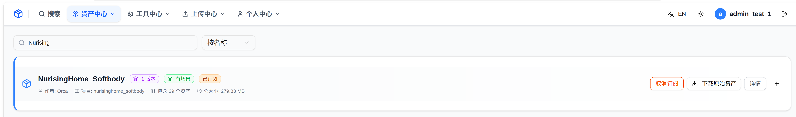
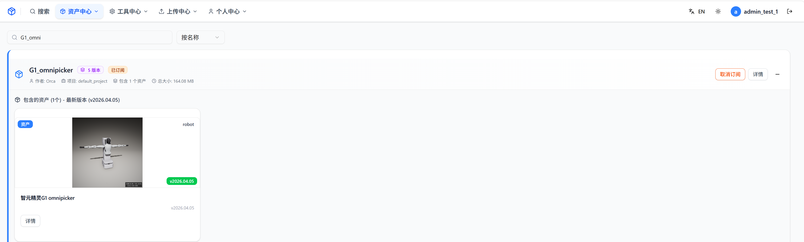
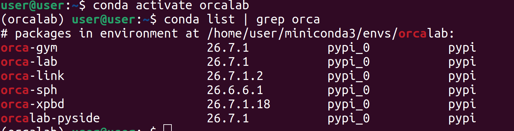
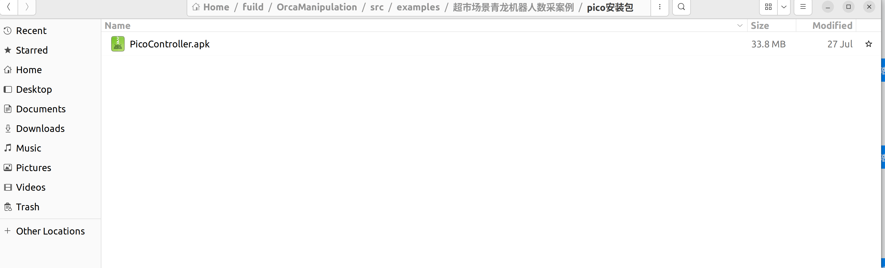
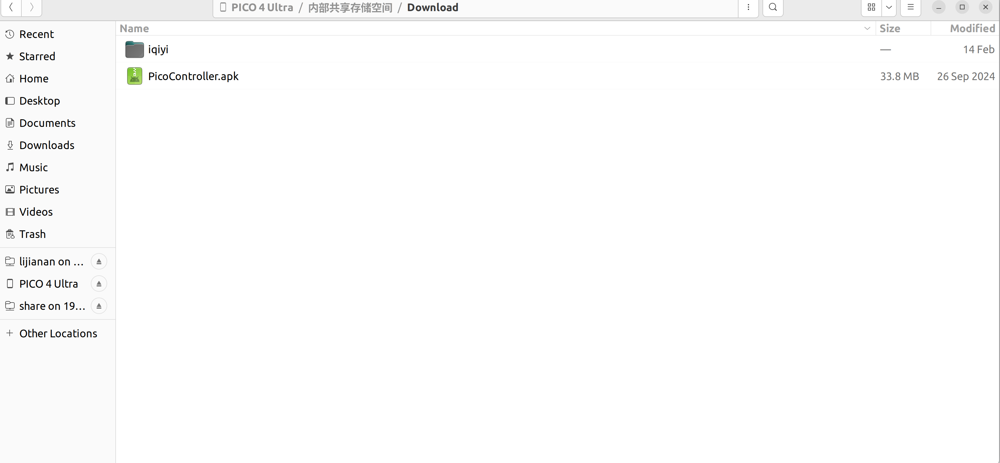
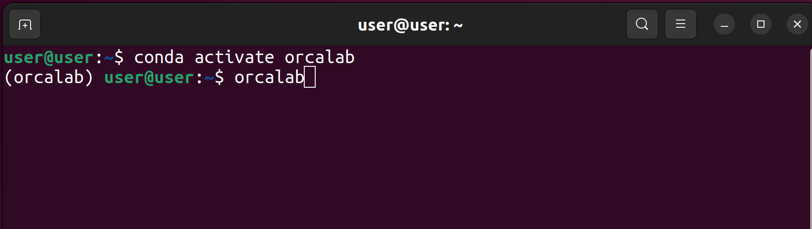
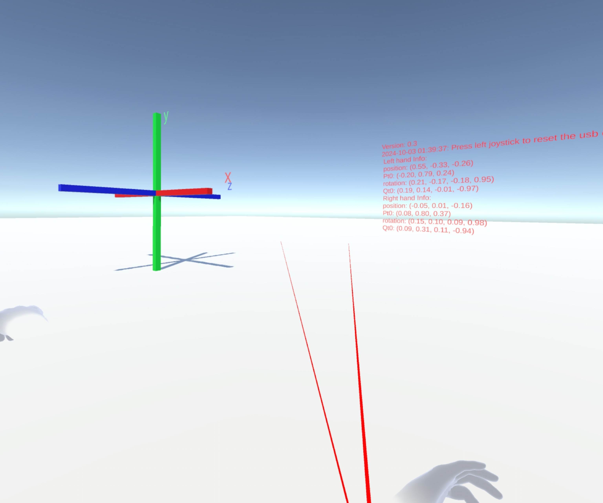
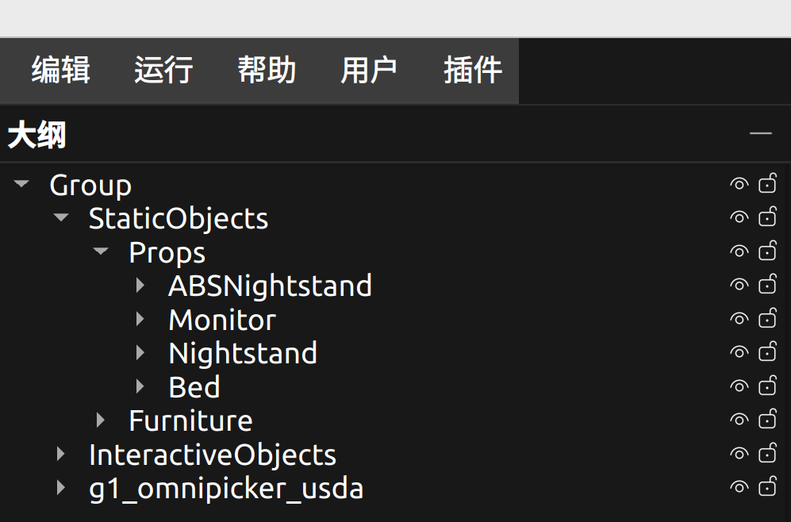

## 一、准备工作

### 1.1 资产库配置
- 资产库链接：[https://simassets.orca3d.cn/](https://simassets.orca3d.cn/)
- 资产中心 → 订阅以下资产：
  - `NurisingHome_Softbody`
  - `G1_omnipicker`




### 1.2 创建 Conda 环境

```bash
conda create -n orcalab python=3.12
pip install -i https://test.pypi.org/simple/ orca-link==26.7.1.2
pip install -i https://test.pypi.org/simple/ orca-xpbd==26.7.1.16
```



### 1.3 下载遥操代码

在同一目录下下载以下三个仓库的指定分支：
- OrcaGym cloth_dev
- OrcaManipulation dev  
- OrcaPlayground cloth_dev


---

## 二、Pico 的安装

### 2.1 下载安装包

将 `PicoController.apk` 安装包下载到电脑上。

安装包路径（将 `<仓库根>` 换为你本机克隆路径）：
```
<仓库根>/OrcaManipulation/src/examples/超市场景青龙机器人数采案例/pico安装包
```



### 2.2 连接 Pico 设备

1. 打开 Pico，并使用 USB 线将 Pico 连接到电脑
2. 将 apk 安装包拷贝到 Pico 目录下



### 2.3 安装 APK 包

在 VR 视角中查看安装包目录，使用右手手柄点击 **A 键**，确认安装 apk 包。

### 2.4 开启开发者模式

1. 在 VR 视角中，点击：**设置 → 关于本机 → 软件版本号**
2. 使用确认键 **A 键**连续点击 **6-7 次**，调出开发者模式


> **至此 Pico 已配置完成**

---

## 三、在 OrcaLab 中的使用

### 3.1 启动 OrcaLab

1. 终端进入 OrcaLab 使用的 conda 环境：
   ```bash
   conda activate orcalab
   ```

2. 执行命令启动 OrcaLab：
   ```bash
   orcalab
   ```



3. 进入 `NursingHome_4cloth` 场景


---

## 四、数据采集

### 4.1 安装 ADB 工具

在 Ubuntu 终端中执行：

```bash
sudo apt install android-tools-adb android-tools-fastboot
```

### 4.2 配置 Pico 与 PC 的通信

1. 使用 USB 数据线连接 Pico 设备与 PC
2. 在终端中执行 adb 命令：

```bash
adb reverse tcp:8001 tcp:8001
```


### 4.3 启动 VR 控制程序

1. 确认在 VR 中打开 `OrcaGymCtrl` 控制程序
2. 将 VR 开机，选择底部的 **资源库**
3. 在资源库中找到并启动 `OrcaGymCtrl`（本项目使用 Ultra4 版本）


> **注意**：VR 启动后会提示设置安全边界，可选择重设或保持原有边界。

启动 `OrcaGymCtrl` 后，会进入一个 3D 界面：
- 左侧显示红 / 蓝 / 绿三维坐标轴
- 中间显示一系列红色文字

该界面为正常现象，后续 VR 遥操作需一直保持在该界面。



### 4.4 启动仿真

1. 将 `G1_omnipicker` 资产拖动导入到场景中
2. 将左侧大纲中机器人的名字重命名为 `g1_omnipicker_usda`，拖入到 `Group` 分组下



3. 点击界面右上角 **绿色启动按钮**
4. 选择 **无仿真程序（手动启动）**


### 4.5 开启数采脚本

1. 激活 Python 数采工程的 conda 环境：
   ```bash
   conda activate <你的数采环境名>
   ```

2. 进入数采脚本目录并启动：
   ```bash
   cd <仓库根>/OrcaManipulation/src/examples/dataCollection_cloth/RunCloth
   ```

3. 设置环境变量并运行仿真：
   ```bash
   export DEBUG="${DEBUG:-0}"
   export XPBD_RELEASE_BUILD="${XPBD_RELEASE_BUILD:-1}"
   export CLOTH_DEBUG="${CLOTH_DEBUG:-0}"
   export COLLECT_DATA="${COLLECT_DATA:-0}"
   export REPLAY="${REPLAY:-0}"
   export CLOTH_NO_REALTIME="${CLOTH_NO_REALTIME:-0}"
   export XPBD_UI="${XPBD_UI:-1}"
   export MAX_MACRO_FRAMES="${MAX_MACRO_FRAMES:-20000}"
   export PBD_GRPC_SBT_ROTATION="${PBD_GRPC_SBT_ROTATION:-from_quat}"
   export LEVEL="${LEVEL:-NursingHome}"
   export AGENT="${AGENT:-g1_omnipicker}"
   export MJC_PREFIX="${MJC_PREFIX:-Group_g1_omnipicker_usda}"
   
   bash run_cloth_robot_p23c.sh
   ```

> **注意**：仿真须已就绪；SceneManager 默认连接 `localhost:50051`，若 OrcaLab 使用其它端口，需与代码或端口映射一致。


### 4.6 手柄操作说明（开始采集）

#### 机械臂复位 / 进入抓取模式
依次按压 **左摇杆、右摇杆**，仿真环境中机械臂可移动，机器人进入抓取操作模式。

#### 开始 / 结束一条轨迹记录
左手柄握持键（`L_GRIPBUTTON`）：在「未开始 → 采集中 → 已结束」状态间切换；用于开始与结束本回合 HDF5 记录（任务成功则保留数据，失败则丢弃）。

#### 夹爪与双臂控制
| 手柄 | 按键 | 功能 |
|------|------|------|
| 左手柄 | X、Y、左扳机 | 控制左夹爪 |
| 右手柄 | A、B、右扳机 | 控制右夹爪 |
| 左手柄 | 左 Transform | 控制左臂 OSC 位姿 |
| 右手柄 | 右 Transform | 控制右臂 OSC 位姿 |

> **重要**：务必掌握握持键以正确开停录制。
