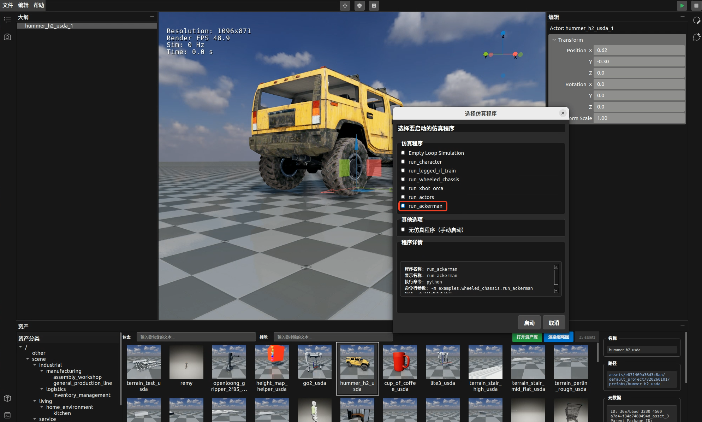

# 快速入门仿真示例
通过四轮底盘小汽车的仿真示例，还原真实四轮底盘的物理运动特性，可直观模拟重力、摩擦力、动力对车辆行驶状态的影响。通过交互式操作与参数调节，你能深入理解三大物理要素在仿真系统中车辆起步、加速、转向、制动等精准呈现。

## ORCALab版本和Playground版本配套关系

| ORCALab 版本    | Playground 版本   |
|----------------|-------------------|
| ORCALab26.4.3  | release/26.4.3    |
| ORCALab26.5.1  | release/26.5.1    |
| ORCALab26.6.3  | release/26.6.1    |
| ORCALab26.7.2  | release/26.7.1    |


## 🎯一、 快速开始一个仿真示例

#### 步骤 1：从github获取OrcaPlayground代码仓库，已集成 OrcaLab 支持。

```bash
# 克隆OrcaPlayground仓库并直接切换到目标分支
git clone --branch release/xx.x.x https://github.com/openverse-orca/OrcaPlayground.git

# 进入项目目录
cd OrcaPlayground

# 激活 OrcaLab 的 conda 环境（根据你的环境名称调整）
conda activate orcalab  # 激活你创建的 OrcaLab 环境名称

# 安装项目依赖（推荐使用清华源或阿里源加快下载速度)
pip install -r requirements.txt -i https://pypi.tuna.tsinghua.edu.cn/simple
```
#### 步骤2：登录资产库订阅OrcaPlaygroundAssets
  
```bash
登录资产库地址： https://simassets.orca3d.cn/ 
订阅资产包名称：OrcaPlaygroundAssets
```
- 订阅资产：找到OrcaPlaygroundAssets资产并订阅


#### 步骤 3：激活 OrcaLab 的 conda 环境

```bash
# 激活 OrcaLab 的 conda 环境（根据你的环境名称调整）
conda activate orcalab  # 激活你创建的 OrcaLab 环境名称
```
⚠️ **注意** ：windows下通过exe安装的Orcalab，必须打开CMD命令行，进入OrcaPlayground目录，使用命令行启动Orcalab

#### 步骤 4：在当前目录启动 OrcaLab

```bash
# 在项目根目录OrcaPlayground下启动 OrcaLab（此时才会自动加载 .orcalab/config.toml）
orcalab
```

⚠️ **注意** ：如果之前已经打开了OrcaLab，订阅资产后，需要关闭Orcalab客户端，再次启动时自动触发下载订阅资产。

#### 步骤 5：在 OrcaLab 中启动示例

1. 需要在资产列表中找到hummer黄色小车，并拖到上面布局中。
2. OrcaLab 界面右上角点运行按钮，打开选择仿真程序窗口。
3. **仿真程序**列表中选择对应的示例程序：

   - `run_ackerman` - 小汽车仿真

   

4. 启动运行仿真程序后，W、S、A、D 键可控制前后左右移动方向。


**更多配置信息参:OrcaPlayground/examples/wheeled_chassis/README.md**

---
 ## 二、 OrcaPlayground项目代码仓介绍及其他几个样例说明

 ## 📦 项目结构

```
OrcaPlayground/
├── envs/                  # 环境定义模块（参考实现，详见 envs/README.md）
│   ├── legged_gym/        #   足式机器人（SB3 / RLlib 训练 + 交互仿真）
│   ├── franka_rl/         #   Franka 多机械臂（SB3 + HER 训练）
│   ├── manipulation/      #   单/双臂操作环境
│   ├── drone/             #   无人机推力环境
│   ├── fluid/             #   SPH 流体耦合仿真
│   ├── character/         #   人形角色动画
│   ├── wheeled_chassis/   #   差速 / 阿克曼底盘
│   ├── g1/  zq_sa01/  xbot_gym/  # 人形 / 四足机器人环境
│   └── common/            #   场景模型扫描等公共工具
├── examples/              # 示例代码目录
│   ├── character/         # 角色仿真（含 README.md）
│   ├── legged_gym/        # 足式机器人 RL 训练 + 交互仿真（含 README.md）
│   ├── wheeled_chassis/   # 轮式底盘：差速 + 阿克曼（含 README.md）
│   ├── xbot/              # XBot 双足机器人（含 README.md）
│   ├── d12/               # D12 双臂机器人（demo 脚本轨迹 + act ACT 策略，含 README.md）
│   ├── franka_rl/         # Franka 多机械臂 RL（SB3 + HER，含 README.md）
│   ├── ant_rl/            # Ant 机器人 RL（Ray RLlib APPO 多环境并行，含 README.md）
│   ├── drone_driver/      # 无人机推力驱动仿真（含 README.md）
│   ├── zq_sa01/           # ZQ SA01 人形（含 README.md）
│   ├── g1/                # G1 人形（含 README.md）
│   ├── orca_locomotion/   # OrcaLocomotion：Go2 / G1 策略回放（含 README.md）
│   ├── replicator/        # 场景复制：Actor / Light（含 README.md）
│   └── fluid/             # 流体仿真（含 README.md）
├── .orcalab/              # OrcaLab 配置文件
│   └── config.toml        # 外部程序配置
└── requirements.txt       # Python 基础依赖
```

## 📚 示例说明

所有示例的详细使用说明请查看examples下各示例目录中的 `README.md`：

- **角色仿真** - (examples/character/README.md)：Remy 角色键盘 / 路径点控制
- **足式机器人 RL 训练** -(examples/legged_gym/README.md)：SB3 PPO + RLlib APPO，支持 Lite3 / Go2 / G1 等
- **轮式底盘** - (examples/wheeled_chassis/README.md)：差速驱动 + 阿克曼转向
- **XBot 机器人** - (examples/xbot/README.md)：基于 humanoid-gym 预训练模型的双足行走
- **D12 双臂机器人** - (examples/d12/README.md)：脚本轨迹回放(examples/d12/demo/README.md)+ ACT 策略推理(examples/d12/act/README.md)
- **Franka 多机械臂 RL** - (examples/franka_rl/README.md)：SB3 + HER，多臂并行训练 + 局部坐标隔离
- **Ant RL** - (examples/ant_rl/README.md)：Ray RLlib APPO 多环境并行训练（单机 / 集群）
- **无人机推力驱动仿真** - (examples/drone_driver/README.md)：CTBR 控制器 + 多机型 profile，键盘 / 手柄操控
- **ZQ SA01 人形** - (examples/zq_sa01/README.md)：Isaac Gym PPO 模型移植
- **G1 人形** - (examples/g1/README.md)：ASAP 策略移植，自由行走 + 键盘控制 + Mimic 动作
- **OrcaLocomotion** - (examples/orca_locomotion/README.md)：PyPI 包回放 Go2 / G1 运动控制策略
- **场景复制** - (examples/replicator/README.md)：Actor 与 Light 批量生成
- **流体仿真** - (examples/fluid/README.md)：SPH 流体与 MuJoCo 刚体耦合


> **⚠️ 重要提示：资产准备**
> 
> 每个示例都需要相应的 3D 资产才能正常运行。**请务必查看各示例目录下的 README.md 文件**，了解：
> - 📦 所需订阅的资产
> - 🔧 是否需要手动拖动资产到场景布局
> - 📝 对应的模型名称
> 
> 资产订阅地址：https://simassets.orca3d.cn/

## 📋 依赖说明


主要依赖：
- `orca-gym>=25.12.4` - OrcaGym 核心包（包含 numpy, gymnasium, mujoco, grpcio 等）
- `torch>=2.0.0` - PyTorch（用于模型推理）
- `stable-baselines3>=2.3.2` - SB3 RL 训练（可选）
- `onnxruntime>=1.16.0` - ONNX 模型推理（可选）

详细依赖说明请查看各examples下的 `requirements.txt`。

## 🔧 OrcaLab 配置仿真程序

### 配置文件位置

OrcaLab 配置文件位于 `.orcalab/config.toml`，OrcaLab 启动时会自动加载工作目录下的此配置文件。

### 已配置的仿真程序

- `run_sim_loop` - 空循环仿真
- `character` - 角色仿真
- `legged_train` - 足式机器人训练（SB3 PPO）
- `legged_rllib_train` - 足式机器人训练（RLlib APPO）
- `wheeled_chassis` - 轮式底盘仿真（差速驱动）
- `anker_chassis` - 阿克曼转向底盘仿真
- `xbot_orca` - XBot 仿真
- `g1` - G1 人形仿真
- `zq_sa01` - ZQ SA01 人形仿真
- `run_actors` - Actor 场景复制
- `run_lights` - 灯光场景复制
- `franka_reach_train` - Franka 多机械臂 Reach 任务训练（TQC + HER）
- `fluid_sim` - 流体仿真

### 添加新仿真程序

如需添加新的仿真程序，编辑 `.orcalab/config.toml` 文件，在 `[[external_programs.programs]]` 部分添加新条目。

#### 配置格式

```toml
[[external_programs.programs]]
name = "your_program_name"           # ⚠️ 必填：程序唯一标识符
display_name = "显示名称"             # ⚠️ 必填：在 OrcaLab UI 中显示的名称
command = "python"                    # ⚠️ 必填：执行命令（通常是 "python"）
args = ["-m", "examples.your_module.run_script"]  # ⚠️ 必填：命令行参数列表
description = "程序描述"              # 可选：程序描述信息
```

#### 参数说明

| 参数 | 类型 | 必填 | 说明 |
|------|------|------|------|
| `name` | 字符串 | ✅ 是 | **程序唯一标识符**，用于 OrcaLab 内部查找和启动程序。必须与所有已配置程序的 `name` 和 `display_name` 都不重复。建议使用小写字母、数字和下划线，如 `my_program`。 |
| `display_name` | 字符串 | ✅ 是 | **显示名称**，在 OrcaLab 启动对话框的 UI 中显示给用户。必须与所有已配置程序的 `name` 和 `display_name` 都不重复。可以使用中文、空格等字符，如 `我的程序`。 |
| `command` | 字符串 | ✅ 是 | **执行命令**，通常是 `"python"`，也可以是其他可执行命令（如 `"python3"`、`"conda"` 等）。 |
| `args` | 字符串数组 | ✅ 是 | **命令行参数列表**，每个参数作为数组的一个元素。例如：<br>- 模块方式：`["-m", "examples.module.run_script"]`<br>- 脚本方式：`["examples/script.py", "--arg1", "value1"]`<br>- 带参数：`["-m", "examples.module.run", "--config", "config.yaml", "--train"]` |
| `description` | 字符串 | ❌ 否 | **程序描述**，用于在 OrcaLab UI 的工具提示中显示，帮助用户了解程序功能。 |

#### ⚠️ 重要注意事项

1. **`name` 和 `display_name` 禁止重复**
   - ❌ **禁止**：两个程序的 `name` 相同
   - ❌ **禁止**：两个程序的 `display_name` 相同
   - ❌ **禁止**：一个程序的 `name` 与另一个程序的 `display_name` 相同
   - ✅ **允许**：同一个程序内部，`name` 和 `display_name` 可以不同（通常建议不同，以便区分）

2. **`name` 的唯一性要求**
   - `name` 是程序在系统中的唯一标识符，OrcaLab 通过 `name` 来查找和启动程序
   - 如果 `name` 重复，`get_external_program_config()` 只会返回第一个匹配的程序，导致后续程序无法正确启动
   - 建议使用有意义的、描述性的名称，如 `legged_train`、`character_sim` 等

3. **`display_name` 的唯一性要求**
   - `display_name` 在 OrcaLab UI 中显示，如果重复会导致用户无法区分不同的程序
   - 建议使用清晰、描述性的显示名称，如 `Legged Robot Training`、`Character Simulation` 等

4. **工作目录**
   - 程序启动时的工作目录是 OrcaLab 的工作目录（通常是 `.orcalab/config.toml` 所在的目录）
   - 在 `args` 中使用相对路径时，请确保相对于工作目录的路径正确

5. **模块导入路径**
   - 使用 `-m` 参数以模块方式运行时，确保模块路径正确
   - 例如：`["-m", "examples.legged_gym.run_legged_rl"]` 表示运行 `examples/legged_gym/run_legged_rl.py`

#### 配置示例

```toml
# 示例 1：简单模块启动
[[external_programs.programs]]
name = "my_simple_program"
display_name = "简单程序"
command = "python"
args = ["-m", "examples.my_module.run_script"]
description = "这是一个简单的示例程序"

# 示例 2：带命令行参数的程序
[[external_programs.programs]]
name = "legged_train"
display_name = "Legged Robot Training"
command = "python"
args = [
    "-m", 
    "examples.legged_gym.run_legged_rl",
    "--config", "examples/legged_gym/configs/sb3_ppo_config.yaml",
    "--train",
    "--visualize"
]
description = "启动足式机器人强化学习训练"

# 示例 3：使用脚本路径（非模块方式）
[[external_programs.programs]]
name = "custom_script"
display_name = "自定义脚本"
command = "python"
args = ["examples/custom/script.py", "--option", "value"]
description = "直接运行脚本文件"
```

#### 验证配置

添加新仿真程序后，建议：

1. **检查重复**：确认新程序的 `name` 和 `display_name` 与所有已配置程序都不重复
2. **测试启动**：在 OrcaLab 中尝试启动新程序，确认命令和参数正确
3. **查看日志**：如果启动失败，查看 OrcaLab 的日志输出，检查命令、参数或模块路径是否正确

### 初始化配置（可选）

如果当前目录没有 `.orcalab/config.toml`，可以使用 OrcaLab 生成基本配置：

```bash
orcalab --init-config
```

然后手动添加本项目的外部仿真程序配置。

## 📖 更多信息

- OrcaPlayground 主仓库：https://github.com/openverse-orca/OrcaPlayground
- 各示例详细说明：查看 `examples/*/README.md`


## 三、技术支持

如遇到问题，请：

1. 查看本文档的"常见问题排查"部分
2. 检查终端错误信息
3. 扫码联系技术支持团队(入群请附上申请邀请码的学校/企业/个人信息等)


---